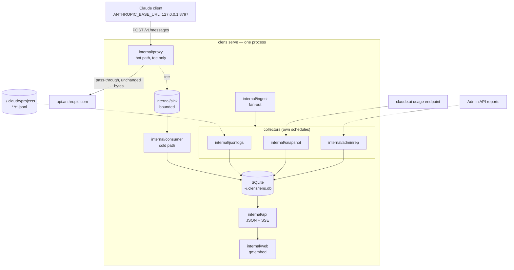

[← INDEX](INDEX.md)

# Architecture

The shipped shape of the process, and the rules a change has to keep. Design rationale lives in
`docs/planning/GI-1-claude-lens-v1.md` §Architecture; the enforced conventions live in `CLAUDE.md`.
This file is the map to the code.

## System purpose

One Go binary, `clens`, sits in front of the Anthropic endpoint and records what was sent, what
came back, what it cost, and which request parameters the API silently dropped. It is a
single-user developer tool: loopback-only by default, no hosted service, no accounts to create.

It reconciles **four sources** — the proxy itself, Claude Code's JSONL transcripts, the claude.ai
usage endpoint, and the Admin API usage/cost reports — so it can report usage and cost for every
Claude subscription tier *and* pay-as-you-go API-key billing from one install. See
[workflows.md](workflows.md) for the flows and [cost-and-quota.md](cost-and-quota.md) for the
cost model.

## Tech stack

| Layer | Choice | Version | Evidence |
|---|---|---|---|
| Language | Go | 1.24.1 | [go.mod](../../go.mod) |
| HTTP | stdlib `net/http` only | — | [internal/api/api.go:184](../../internal/api/api.go#L184) (`http.ServeMux`, Go 1.22 method patterns) |
| Storage | SQLite via `modernc.org/sqlite` (pure Go, no cgo) | v1.46.1 | [internal/store/store.go:22](../../internal/store/store.go#L22) (blank import) |
| Decompression | `klauspost/compress/zstd`, `andybalholm/brotli` | v1.17.11, v1.1.1 | [internal/decode/decode.go](../../internal/decode/decode.go) |
| Dashboard assets | `go:embed`-ed HTML/CSS/JS, no build step | — | [internal/web/embed.go](../../internal/web/embed.go) |
| CLI | stdlib `flag` + a dispatch map | — | [cmd/clens/main.go](../../cmd/clens/main.go) |

Three modules beyond the standard library and no more. The two compression libraries exist
*because* decoding happens in the cold path — see [decisions/002](decisions/002-hot-path-never-parses.md).

## Components

One process, two `http.Server`s on separate loopback listeners, plus collector goroutines.
`clens serve` ([internal/cli/serve.go](../../internal/cli/serve.go)) is the only subcommand that
starts a process rather than doing a job and exiting, and it owns every long-lived goroutine.

| Listener | Default | Serves |
|---|---|---|
| proxy | `127.0.0.1:8797` | [internal/proxy](../../internal/proxy/) — a transparent `/v1/messages` pass-through |
| dashboard | `127.0.0.1:8798` | [internal/api](../../internal/api/) — the JSON routes, the SSE stream, and the embedded [internal/web](../../internal/web/) assets |

Both are loopback-only unless `allow_remote` is set ([internal/config/config.go](../../internal/config/config.go)
`Validate()`). `clens doctor` prints the effective config, the bind addresses, and a PASS/WARN/FAIL
per check.

A third, optional listener — `net/http/pprof` behind `--pprof-addr` (GI#13) — stays loopback-locked
**even when `allow_remote` is set**: a heap profile is a dump of whatever is in process memory, so
`--allow-remote` widening the dashboard and proxy must not also widen this one. See
[security-and-permissions.md](security-and-permissions.md).

### The three stages

| Stage | Package | Owns |
|---|---|---|
| Hot path | [internal/proxy](../../internal/proxy/) | the client's goroutine: tee bytes, return. No parsing, no decompression, no database. |
| Transport | [internal/sink](../../internal/sink/) | a bounded buffer between the two — the only thing they share. |
| Cold path | [internal/consumer](../../internal/consumer/) | its own goroutine: drain, decompress, parse, run analyzer rules, price, write. |

**The import rule that enforces the split:** `internal/proxy` may import only `internal/sink` and
`internal/config`. Asserted by [internal/proxy/importguard_test.go](../../internal/proxy/importguard_test.go).
If it ever imports `analyze`, `store`, or `pricing`, the hot path has grown a dependency on the
cold one.

### The four sources and their writers

| Source | Written by | Cadence |
|---|---|---|
| `proxy` | [internal/consumer](../../internal/consumer/) | continuous, as calls arrive |
| `jsonl` | [internal/jsonlogs](../../internal/jsonlogs/) | `clens ingest` / `refresh`, incremental from a byte cursor |
| `snapshot` | [internal/snapshot](../../internal/snapshot/) | `clens refresh` — the claude.ai usage endpoint |
| `admin` | [internal/adminrep](../../internal/adminrep/) | `clens refresh` — the Admin usage/cost reports |

[internal/reconcile](../../internal/reconcile/) compares `proxy`/`jsonl` computed cost against the
`admin` billed figure; the cross-source merge in [internal/store/merge.go](../../internal/store/merge.go)
folds a `jsonl` row onto a `proxy` row when they describe the same call. It is the only part of the
ingest pipelines that rewrites an `events` row already written — the other writers of a stored row are
the two operator repairs, `clens reprice` and `clens reflag`
([cli-and-tooling.md](cli-and-tooling.md)) — which is why the merge re-derives the row's
`capture_complete` from the bodies it keeps rather than preferring one side's flag
(see [storage-schema.md](storage-schema.md) §The merge rule).

Each source runs independently. [internal/ingest](../../internal/ingest/) is the fan-out that
drives the three **non-proxy** collectors — the proxy is deliberately not one of its collectors,
because it runs continuously rather than on a schedule — and `GET /api/sources` plus the
dashboard's Sources tab are how per-collector health is made visible rather than assumed.

### Support packages

| Package | Responsibility |
|---|---|
| [internal/parse](../../internal/parse/) | request metadata, SSE stream, usage block — cold path only |
| [internal/decode](../../internal/decode/) | `br` / `zstd` / `gzip` body decoding |
| [internal/analyze](../../internal/analyze/) | the rule engine and the one spelling of every warning kind |
| [internal/session](../../internal/session/) | session resolution and the incremental per-session fold |
| [internal/pricing](../../internal/pricing/) | the shipped rate table, overrides, and `Compute()` — including the per-model peak window and the `PeakComputer` seam |
| [internal/quota](../../internal/quota/) | rolling-window burn, snapshot cross-check, limit calibration |
| [internal/replay](../../internal/replay/) | replay payload construction and edit application |
| [internal/catalog](../../internal/catalog/) | the models-endpoint catalogue |
| [internal/config](../../internal/config/) | flag > env > file > defaults, and `Validate()` |
| [internal/secret](../../internal/secret/) | the only package that touches a credential value |

## Cross-cutting concerns

### Fail open

Two rules, both load-bearing:

1. **A broken observer never breaks the user's coding session.** The proxy returns whatever
   upstream returned, or a synthesized error if upstream was unreachable. A capture failure is
   logged, never propagated to the client.
2. **A broken collector never prevents the others from writing.** Each collector's error is
   recorded against its own source row.

Evidence: `TestFailOpenOnUpstreamFailure`, `TestPolicyOffSurvivesAMissingRequestID` and the
pass-through tests in [internal/proxy/proxy_test.go](../../internal/proxy/proxy_test.go); per-source
outcome handling in [internal/ingest](../../internal/ingest/). The "is logged" half of rule 1 held
for the consumer's write failures before GI#15 but not for a sink drop under load — `Sink.Submit`'s
return value was discarded, so the only trace was an in-memory counter that reset on restart.
`TestSubmitLogsADropWithoutTheBody` is the first test to assert an actual log line, not just that
the client is unaffected.

Rule 1 is the one a new code path is most likely to break, and it has broken once: under
`--body-policy off` the capture path hashed a nil request body, and on the transport-failure branch
the panic landed before the `502` was written — so a failed upstream answered with an aborted
connection. `net/http` recovers handler panics and logs them, so the test suite stayed green while
it happened. A new branch on the hot path owes a test that drives *its* failure mode, not just its
happy one; see [security-and-permissions.md](security-and-permissions.md). The green-suite half is
now closed structurally rather than by remembering: `proxyServer(t, h)` in
[internal/proxy/proxy_test.go](../../internal/proxy/proxy_test.go) is the only way a proxy test
builds a server, and it fails the test if a panic reached the recovered-error log.

### Error handling

`%w`-wrapped `fmt.Errorf` throughout (189 wrapping sites vs 63 non-wrapping in `internal/`), so a
caller can `errors.Is`/`errors.As` rather than match on a string. Sentinel errors are exported
where a caller must branch — `secret.ErrUnset` is the canonical example.

### Configuration

Resolved in one place, in one order: **flags > `CLENS_*` environment > `~/.clens/config.toml` >
built-in defaults** ([internal/config/config.go](../../internal/config/config.go)). Every
subcommand takes the same flag set. Names are in [build-and-run.md](build-and-run.md).

### Credentials

[internal/secret](../../internal/secret/) is the only package that touches a credential value. It
writes `~/.clens/secrets.toml` — a file **outside** the database. The containment rules and the
Windows ACL mechanism are in [security-and-permissions.md](security-and-permissions.md).

### Injected seams

The dashboard may not name `secret`, `config`, or `ingest`, so every write and every dependency it
has on them is a settable function value on the API type, wired in the composition root
([internal/cli/serve.go](../../internal/cli/serve.go)):

| Seam | Producer |
|---|---|
| `SetPricing` | `pricing.Loader` |
| `SetCredentialWriter` | `secret.Save` |
| `SetAccountWriter` | the accounts file |
| `SetIngestTrigger` | `ingest.RunOnce` |
| `SetSourceHealth` | `ingest.Health` (read) |
| `SetAccounts` | the accounts file (read) |

**An unwired seam answers `503` with a reason, never an empty result.** "No collector is wired" and
"every collector is fine and has written nothing" are different claims, and a dashboard that
renders them identically is one that cannot be trusted about the difference.

## Component diagram

## External integrations

The four sources above are the four external touchpoints; each one's endpoint, auth, and failure
impact is tabulated in [integrations-and-external-services.md](integrations-and-external-services.md).

## Where to look next

- [internal/api/api.go:1](../../internal/api/api.go#L1) — the package doc: the route table and the seam rules.
- [internal/store/schema.sql](../../internal/store/schema.sql) — every table, one file, plus the `PRAGMA user_version` migration runner in [internal/store/store.go](../../internal/store/store.go). See [storage-schema.md](storage-schema.md).
- [internal/analyze/kinds.go](../../internal/analyze/kinds.go) — the one spelling of every warning kind.
- [decisions/](decisions/000-index.md) — the architectural forks, and why the rejected side lost.
- `CLAUDE.md` §Architecture essentials — the invariants in their shortest form.
