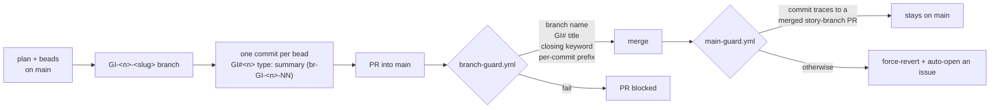

[← INDEX](INDEX.md)

# Infrastructure & Deployment

Short by design: this is a local developer tool. There is no server, no environment tier, and no
deploy. The infrastructure that *does* exist is repository governance.

## Environments

| Env | Purpose | How it's provisioned | Evidence |
|---|---|---|---|
| a developer's machine | the only environment | `go install` / `go build` | [README.md](../../README.md) §Install |
| GitHub (`abhishekar30/claude-lens`) | the repository, its issues, and two CI guards | — | [.github/workflows/](../../.github/workflows/) |

**No dev/staging/prod split, no IaC, no container.** No `Dockerfile`, no `docker-compose.yml`, no
Terraform/CDK, no `serverless.yml`. v1 is `main`-only, and `main` is the repo's default branch.

## Deploy pipeline

There isn't one. The closest equivalent is the **merge** pipeline, which is what the two guards
police:

| Workflow | Trigger | What it enforces |
|---|---|---|
| [branch-guard.yml](../../.github/workflows/branch-guard.yml) | `pull_request` into `main` (opened/synchronize/reopened/edited) | head branch matches `^GI-[0-9]+-[a-z0-9-]+$`; title starts `GI#<n>` naming a **real issue**; body contains a closing keyword for that issue; **every** number found after a closing keyword is a real issue; the branch's number is one the body closes; every non-merge commit starts with a `GI#<id>` the body closes |
| [main-guard.yml](../../.github/workflows/main-guard.yml) | `push` to `main` | the pushed commit came from a merged `GI-<n>-…` → `main` PR; otherwise **force-reverts** it and opens an issue naming the actor |

Neither runs tests. Neither builds anything.

### Two adaptations that matter

Both guards are carried over from `deepseek-lens`, and both were **adapted rather than copied** —
the originals hard-gate on a `develop` integration branch this repo does not have. Copying them
verbatim would have rejected this repo's own first PR. The change is recorded in
[CLAUDE.md](../../CLAUDE.md) §Enforcement and in [decisions/005](decisions/005-no-develop-branch.md):

- `head_ref == 'develop'` → `^GI-[0-9]+-[a-z0-9-]+$`
- "traces to a merged `develop → main` PR" → "traces to a merged `GI-<n>-… → main` PR"
- Because one hop to `main` no longer proves provenance the way `develop` did, `branch-guard`
  **gained a fourth step**: the branch's issue number must be one the PR body closes.

### One sharp edge in `main-guard`

Its `verify-source` job is skipped when `github.event.before` is all zeros — which is exactly the
case for a **newly created branch**. That is why creating `main` did not trigger a force-revert. A
*later* push to `main` outside the story-branch flow does get reverted.

## Config & secrets wiring

Names only, never values.

| Name | Purpose | Where |
|---|---|---|
| `GITHUB_TOKEN` | used by both guards to read issues/PRs and to push the revert | GitHub Actions, automatic |
| `CLENS_*` | the environment tier of runtime config | the user's shell |
| `~/.clens/config.toml` | the file tier | user filesystem |
| `~/.clens/accounts.toml` | configured accounts, plans, and billing modes | user filesystem |
| `~/.clens/secrets.toml` | the credential file — **outside the database**, ACL-protected on Windows | user filesystem; [security-and-permissions.md](security-and-permissions.md) |

`.gitignore` covers `*.db`, `*.db-wal`, `*.db-shm`, `config.toml`, `accounts.toml`,
`secrets.toml`, `/**/*review*/`, and the built binary — so no runtime state can be committed by
accident.

## Rollback / recovery

| Situation | Recovery |
|---|---|
| A commit lands on `main` outside the PR flow | `main-guard.yml` force-reverts to `github.event.before` and opens an issue |
| A bad merge via a PR | revert on `main` through a new `GI-<n>-…` branch — the direct-push path is reverted by the guard |
| Local data loss | the database is a file: restore `~/.clens/lens.db`, or re-derive source B with `clens ingest --rebuild` |
| A stale price table | `cost_drift` fires; `clens prices` shows the effective table and the edit path |
| A failed Windows ACL write | **fails closed** — the credential is not written and an existing file is left byte-identical |

There is no artifact registry, so there is no rollback of a "release". A user reverts by checking
out an earlier commit and rebuilding.
