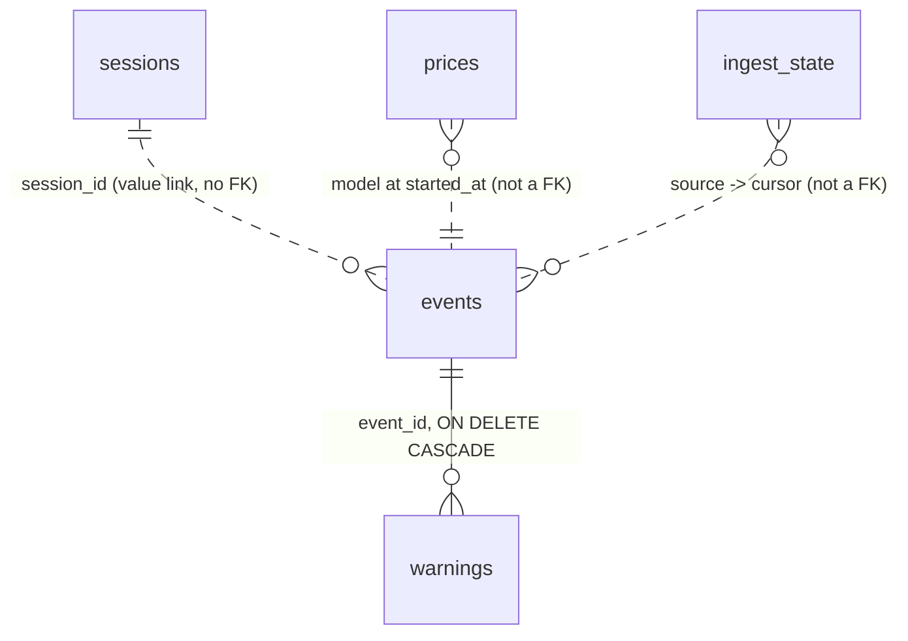

[← INDEX](INDEX.md)

# Storage schema

One SQLite file, `~/.clens/lens.db`, created whole from
[internal/store/schema.sql](../../internal/store/schema.sql) — no migration framework in v1
(`CREATE TABLE IF NOT EXISTS` only). Times are Unix nanoseconds.

*(This file fills the `data-model` role for this repo: one schema file, no ORM, no migrations.)*

The schema is the enforcement point for two invariants, which is why it is worth reading before
changing a column: see [architecture.md](architecture.md) and [cost-and-quota.md](cost-and-quota.md).

## Entity catalogue

**Traffic** — what a call was:

| Table | Purpose | Key fields | Constraints / indexes | Evidence |
|---|---|---|---|---|
| `events` | one row per captured call: identity, tokens, cost, and the proxy-only request/response columns | `id`, `request_id`, `source`, `first_source`, `session_id`, `total_prompt_tokens`, `cost_usd`, `api_equivalent_cost_usd`, `cost_source`, `req_body`/`resp_body` | `request_id` **UNIQUE** (this is what makes the merge possible); indexes on `session_id`, `started_at`, `cost_source` | [schema.sql](../../internal/store/schema.sql) |
| `sessions` | the per-session fold: summed tokens, priced/unpriced counts, warning count | `id` PK, `prefix_hash`, `first_seen`/`last_seen`, every token column, `priced_count`, `unpriced_count`, `model_set`, `warning_count`, both cost columns | no FK — the link to `events` is by `session_id` value only | [schema.sql](../../internal/store/schema.sql) |
| `warnings` | one row per (event, kind) | `event_id`, `kind`, `severity`, `detail`, `path` | `UNIQUE(event_id, kind)`; `REFERENCES events(id) ON DELETE CASCADE` | [schema.sql](../../internal/store/schema.sql) |

**Collector output** — what a source reported:

| Table | Source | Key fields | Constraints |
|---|---|---|---|
| `admin_usage_days` | `admin` | `day_start`, `model`, `workspace_id`, the four token columns | `UNIQUE(day_start, model, workspace_id)` |
| `admin_cost_days` | `admin` | `day_start`, `model`, `description`, `amount_usd`, `currency` | `UNIQUE(day_start, model, description, currency)` |
| `admin_rate_limits` | `admin` | `scope`, `workspace_id`, `model`, `group_type`, `limit_value` | append-only, `fetched_at`-stamped |
| `quota_snapshots` | `snapshot` | `observed_at`, `account`, `window`, `utilization_pct`, `resets_at`, `status` | append-only observations |

**Reference and state**:

| Table | Purpose | Constraints |
|---|---|---|
| `prices` | the effective rate table per model | `PRIMARY KEY (model, effective_from)` — a rate change is a **new row**, not an update |
| `model_catalog` | what the models endpoint advertised | `model_id` PK |
| `ingest_state` | one row per collector cursor, with `status` and `error` | `key` PK |

`ingest_state` is what `GET /api/sources` reads, and what makes a failed collector visible instead
of a quietly short chart.

## Relationships

Only the `events → warnings` edge is enforced by the database. The other three are value
relationships the queries join on; a `session_id` that names no session row is representable and
would not be caught by SQLite.

## Enums & status lifecycles

These are `TEXT` columns, not SQL enums — the valid vocabulary lives in Go and is pinned by tests.

| Column | Values | Pinned by |
|---|---|---|
| `events.source` | `proxy` \| `jsonl` \| `snapshot` \| `admin` | the four writer packages |
| `events.auth_kind` | `oauth` \| `api_key` \| `admin` \| `cloud` \| `unknown` | [cost-and-quota.md](cost-and-quota.md) |
| `events.billing_mode` | `subscription` \| `api` | `TestBillingModeInvariants` |
| `events.cost_source` | `shipped` \| `provisional` \| `user` \| `approximate:<reason>` \| `unpriced` | `TestBillingModeInvariants` |
| `warnings.kind` | the 22 kinds in [internal/analyze/kinds.go](../../internal/analyze/kinds.go) | `internal/analyze/readme_test.go` |
| `warnings.severity` | `info` \| `warn` \| `error` | [internal/analyze/kinds.go](../../internal/analyze/kinds.go) |
| `quota_snapshots.status` | the endpoint's own reported status, stored verbatim | [internal/snapshot](../../internal/snapshot/) |
| `ingest_state.status` | per-collector outcome; `error` carries the message | [internal/ingest](../../internal/ingest/) |

`events.capture_complete` is a flag rather than an enum: it says whether the captured body is the
whole thing or was narrowed by the policy and the 256 KB cap.

## Token columns

Total prompt size is **`input_tokens + cache_write_5m_tokens + cache_write_1h_tokens +
cache_read_tokens`** — `input_tokens` is the uncached remainder only. `events.total_prompt_tokens`
(and `sessions.total_prompt_tokens`) stores the sum so a query does not have to re-derive it, and
`TestDerivedPromptTotal` asserts the two agree. A row that reports `input_tokens` alone as the
prompt size is wrong.

## The billing split, in columns

Two billing models that must never be summed, carried by *which column the figure lives in*:

| `billing_mode` | `cost_usd` | `api_equivalent_cost_usd` |
|---|---|---|
| `api` | the computed cost | NULL |
| `subscription` | NULL | the hypothetical API-equivalent value |

No `SUM(cost_usd)` — with or without a JOIN — can merge them, because they are never in the same
column. `sessions` mirrors the split with `total_cost_usd` and `total_api_equivalent_cost_usd`. See
[decisions/001](decisions/001-billing-split-by-column.md).

`cost_source` labels how the figure was arrived at: `shipped` (from the bundled table),
`provisional` (bundled but unverified), `user` (an override), `approximate:<reason>` (a rate
applied with a known caveat), or `unpriced` (no rate row — the cost columns stay NULL, never
`0.0`). A schema invariant test in [internal/store](../../internal/store/) — `TestBillingModeInvariants`
and `TestSessionCostSplit` — pins all of it.

## Persistence rules

| Rule | Detail |
|---|---|
| **One writer per source** | `events` has one writer *package* per source, serialized by the store's single write connection (`SetMaxOpenConns(1)`) rather than by the schema. The proxy consumer owns `source='proxy'`; [internal/jsonlogs](../../internal/jsonlogs/) owns `source='jsonl'`. |
| **One `UPDATE`, one transaction** | The cross-source merge ([internal/store/merge.go](../../internal/store/merge.go)) is the first `UPDATE` on `events` and re-derives the owning session's totals **in the same transaction**. It has to: a merge can rewrite a row's token columns, and an incremental fold would drift away from the sum it is supposed to equal. |
| **Upsert over append** | Collector output is keyed and upserted (`ON CONFLICT … DO UPDATE`), so re-running a collector is idempotent — `TestAdminUpsertIdempotent`, `TestIngestStateUpsert`, `TestWarningUpsertIdempotent`. |
| **`prices` is append-only** | A rate change inserts a new `(model, effective_from)` row; the row in force at an event's time is the one with the greatest `effective_from ≤ started_at`. |
| **No soft deletes** | `clens purge` deletes rows. It is the only destructive command and defaults to the opposite of destructive: nothing goes without `--yes`, and `--dry-run` prints what `--yes` would have removed. |
| **Cascade is scoped** | `ON DELETE CASCADE` appears only on `warnings.event_id`. Purging an event takes its warnings with it; nothing else cascades. |
| **Concurrency** | Readers proceed during a write batch — `SetMaxOpenConns(1)` serializes writers, not readers. `TestConcurrentReadersDuringWriteBatch`. |
