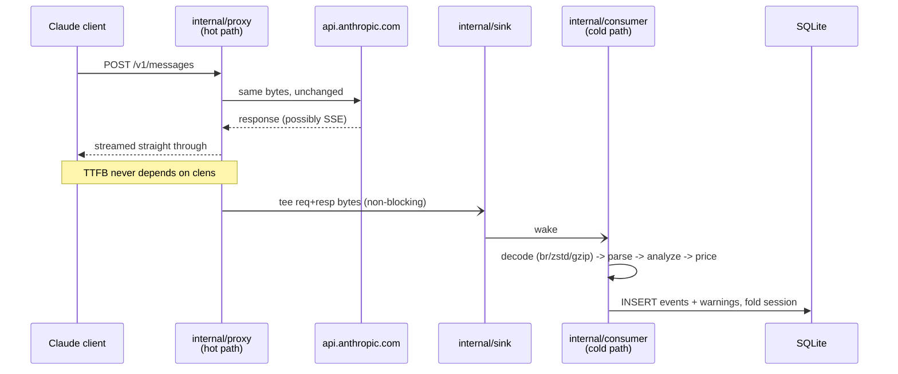
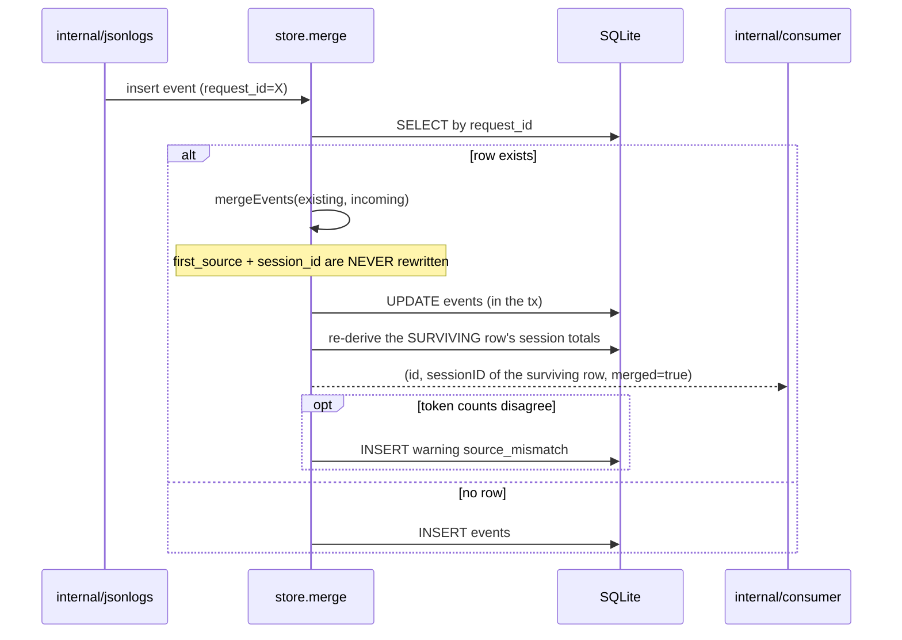
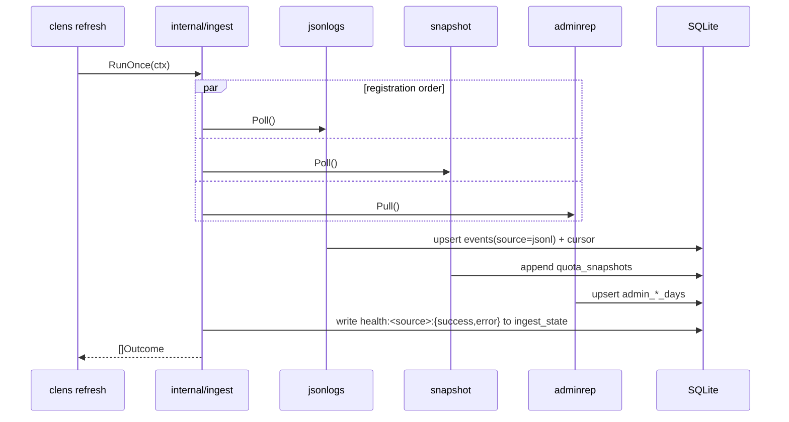
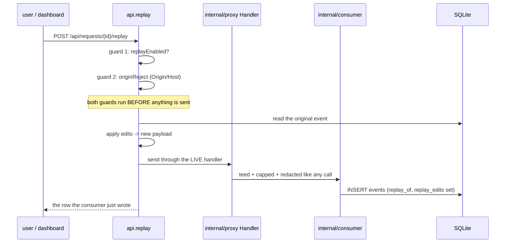
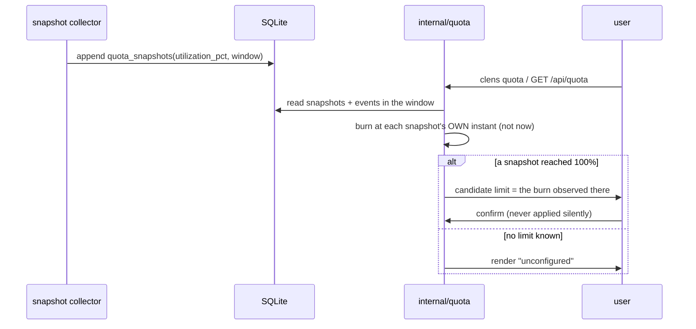

[← INDEX](INDEX.md)

# Workflows

The six flows that span more than one package. Each one's failure modes and transaction boundaries
are called out below the diagram, because those are what a change is most likely to break.

## 1. A proxied call — capture without slowing the client

The defining flow. Everything expensive is deferred off the client's goroutine.

**Failure modes / retries / idempotency / transaction boundaries:**

- **A capture failure is logged, never propagated.** Upstream unreachable → the client gets a
  synthesized error; `TestFailOpenOnUpstreamFailure`.
- **The tee must not block the client.** The sink is bounded and drops rather than waits — a slow
  consumer degrades capture, never latency.
- **Zero seams is a supported state.** A consumer with nothing wired still writes rows (zero usage,
  no warnings beyond `upstream_error`/`analyzer_panic`), rather than panicking.
- **`InsertEvent` returns `(id, sessionID, error)`, and `sessionID` may not be `ev.SessionID`.**
  On a `request_id` merge it is the *existing* row's session. Every session-scoped call keys off
  the returned value — see flow 2.

## 2. Cross-source merge — the one `UPDATE` on `events`

Source A and source B can both describe the same call. `request_id` is `UNIQUE`, so the second
arrival merges instead of inserting.

**Failure modes / retries / idempotency / transaction boundaries:**

- **The merge and the session re-derivation are one transaction.** A merge rewrites a row's token
  columns, so an incremental fold would drift from the sum it is supposed to equal. `sessions` is
  therefore *recomputed*, not incremented, on this path.
- **`first_source` and `session_id` are never rewritten** ([internal/store/merge.go:181](../../internal/store/merge.go#L181)).
  Consequence: the surviving row can belong to the **incoming event's** session or the **existing**
  one — which is why `insertOrMerge` returns the session id and every caller uses *that*.
  Reconciling `ev.SessionID` instead creates a session row owning no events and leaves the real
  session out of the analysis. This was an implementation-cross-review finding, fixed in `8650b9a`.
- **`billing_mode` moves with the winning cost columns** — it is *not* `preferNonEmpty` like its
  neighbours. This is the one column a merge is expected to contradict: the JSONL tailer resolves it
  per row by model prefix, so re-ingesting a DeepSeek call flips it `subscription` → `api`. Keeping
  the stored mode while adopting the incoming cost would leave a `subscription` row carrying a real
  `cost_usd` — the pair [decisions/001](decisions/001-billing-split-by-column.md) forbids.
  `account` and `auth_kind` stay `preferNonEmpty` deliberately: a JSONL line carries no auth signal,
  and on the ordinary ordering the live proxy row already holds the real account name.
- **A winner with no mode derives one from the column it priced.** An unclassified credential leaves
  `billing_mode` as `''`, which matches neither of the aggregates' `CASE WHEN` branches and would
  drop the row from every total, so the label follows the money: `cost_usd` → `api`,
  `api_equivalent_cost_usd` → `subscription`. A winner that priced nothing keeps the stored mode
  instead, because there is no cost column for an adopted label to contradict.
- **A disagreement is a finding, not an error:** `source_mismatch` is written and both rows survive
  as one merged row.
- **Idempotent:** re-ingesting the same JSONL re-merges to the same result. That is what makes
  `clens ingest --rebuild` the re-pricing path rather than a duplicate-row risk.

## 3. `clens refresh` — the collector fan-out

**Failure modes / retries / idempotency / transaction boundaries:**

- **The proxy is deliberately not one of `RunOnce`'s collectors** — it runs continuously, not on a
  schedule ([internal/ingest/ingest.go:9](../../internal/ingest/ingest.go#L9)).
- **A broken collector never prevents the others from writing.** `runOne` isolates both errors and
  **panics** per collector; each failure is recorded against its own source.
- **Collectors run in registration order, not concurrently** in the loop — parallelism is the OS
  scheduler's business here, and the store serializes writers anyway (`SetMaxOpenConns(1)`).
- **Idempotent by upsert:** re-running `refresh` re-upserts the same keys.
- **A cursor is a resume point, not a transaction:** `ingest` keeps a byte offset per JSONL file,
  so a crash mid-run re-reads from the last committed cursor.

## 4. Ingest reconciliation — `clens ingest --rebuild`

Same fan-out restricted to source B, with the cursor discarded. `--rebuild` exists precisely
because the cursor is an optimization that can be wrong: if a transcript is rewritten, the byte
offset is meaningless and only a from-zero pass is correct.

**Transaction boundary:** per event, via the same merge path as flow 2. A rebuild therefore
*merges* rather than duplicates, which is what makes `source_mismatch` reachable on a re-run.

## 5. Replay — the one route that spends money

**Failure modes / retries / idempotency / transaction boundaries:**

- **Both guards run before a single byte reaches upstream.** That ordering is the point of the
  guard.
- **Replay sends through the live proxy handler**, not a transport of its own — so it picks up the
  same tee, body cap, and header redaction, and reaches SQLite through the consumer's single
  writer. A replay is therefore *not* a special write path.
- **Not idempotent, by nature** — it is a real billable call. `replay_of` links it to its original.
- **The cost gate is in the CLI, not the API** — the CLI is what knows whether `--yes` was passed.
- **Every rejection increments `replayRejected`**, visible on `GET /api/health`.

## 6. Quota calibration — learning a limit instead of inventing one

**Failure modes / retries / idempotency / transaction boundaries:**

- **`CrossCheck` uses each snapshot's own instant**, not `now`, so an old snapshot is compared
  against the window as it stood then.
- **A limit is never guessed.** `Projection.Configured` is false with no limit and the caller must
  render `unconfigured` — reading `UtilizationPct` as a real 0% is the failure this prevents.
- **Calibration proposes; the user disposes.** Candidates are offered for confirmation, never
  applied silently.
- **Read-only:** this flow writes nothing.
