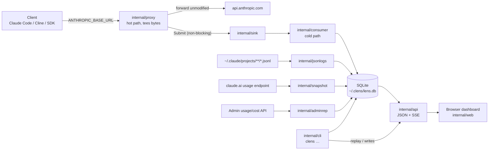

# GI-1 — claude-lens v1

<!-- version=2 status=draft -->

Ticket: [issue #1](https://github.com/abhisheksarkar30/claude-lens/issues/1) · Branch: `GI-1-claude-lens-v1` (off `main`; no `develop` exists yet) · Module: `github.com/abhisheksarkar30/claude-lens`

`claude-lens` is a local, loopback-only observability and usage/cost accounting tool for Claude. One
Go binary (`clens`), one SQLite file, no hosted service. It answers, for **every** way a person can
pay for Claude — Free, Pro, Max 5x, Max 20x, Team, Enterprise, and pay-as-you-go API keys — *how
much am I using, on what, what did it cost, and how close am I to my limit*. It carries over the
full feature set proven in `deepseek-lens` and extends it from one traffic source to four.

---

## What changes

A new Go module at `D:\github\claude-lens`. Nothing pre-exists; every file below is created.

```
claude-lens/
├── go.mod, README.md, .gitignore, LICENSE
├── cmd/clens/main.go                    subcommand dispatch
├── internal/
│   ├── config/                          flags + file + env, defaults, validation, accounts
│   ├── secret/                          ~/.clens/secrets.toml (POSIX 0600 / Windows ACL) — admin key, sessionKey
│   ├── sink/                            bounded channel, drop counter — the non-blocking guarantee
│   ├── proxy/                           reverse proxy, tee, header redaction, fail-open
│   ├── decode/                          Content-Encoding removal (gzip/deflate/br/zstd)
│   ├── parse/                           incremental SSE + non-stream JSON; meta + usage extraction
│   ├── store/                           SQLite schema, single ingest writer, reads, purge
│   ├── catalog/                         model catalogue (live GET /v1/models + shipped fallback)
│   ├── pricing/                         price table, per-class cost arithmetic, drift
│   ├── session/                         conversation grouping
│   ├── analyze/                         rule engine (cache, thinking, response, billing kinds)
│   ├── quota/                           rolling-window burn, plan limits, snapshot calibration
│   ├── consumer/                        proxy ingest pipeline (sink → parse → session → cost → store)
│   ├── jsonlogs/                        Claude Code .jsonl incremental tailer → events
│   ├── snapshot/                        claude.ai quota poller → quota_snapshots
│   ├── adminrep/                        Admin API usage/cost reports → admin_*_days
│   ├── reconcile/                       computed-vs-billed drift; source cross-checks
│   ├── ingest/                          orchestration of the three non-proxy collectors + scheduler
│   ├── replay/                          body-edit + re-issue logic
│   ├── api/                             dashboard JSON API + SSE broker
│   ├── cli/                             subcommand implementations
│   └── web/                             go:embed'd index.html, app.js, style.css
└── docs/, .beads/, .githooks/, .github/workflows/
```

---

## Why — mapping to requirements

| Requirement (issue #1) | Delivered by |
|---|---|
| One binary, one SQLite file, loopback-only | `cmd/clens`, `internal/store`, `internal/config.Validate` |
| Four sources, each failing independently | `proxy`+`consumer`, `jsonlogs`, `snapshot`, `adminrep` — independent writers, per-source health in `GET /api/sources` |
| A turn seen twice is stored once | `events.request_id` UNIQUE + `source_refs` (see *Cross-source identity*); the dedup key's equivalence to Claude Code's `requestId` is an assumption with a verification step, not yet evidence |
| Subscription and API figures never merged | Enforced by the schema, not by discipline: a subscription row leaves `events.cost_usd` NULL and carries `api_equivalent_cost_usd` instead, so `SUM(cost_usd)` cannot merge the two billing models with or without a JOIN; every aggregate surface additionally groups by `billing_mode` (see *Billing model* and invariant 5) |
| Computed cost reconciled against billed | `internal/reconcile` + `cost_drift` warning + `clens reconcile` |
| No invented numbers | Empty-by-default price rows and plan limits; `unpriced` / `unconfigured` are first-class labelled states |
| Credentials never in the DB, logs, or UI | `internal/secret` (outside the DB; POSIX modes on Unix, an explicit Windows ACL on Windows), `internal/proxy/redact`, startup `RedactCheck`, dashboard never reads `secret` |
| Full deepseek-lens feature set | *Carried over* table below |

### Carried over from deepseek-lens

Every v1 feature lands with a recorded disposition — including the ones deliberately dropped, and the reason. The table's contract is that no feature is *silently* dropped; where a feature is absent it is because a row below says so.

| Feature | Disposition |
|---|---|
| Streaming reverse proxy, tee, fail-open | **kept** — upstream default `https://api.anthropic.com` |
| TTFB no-buffering hard gate + `TestNoBufferingSSE` | **kept verbatim** — still the hard gate |
| Bounded non-blocking sink + drop counter | **kept verbatim** |
| Response/request body capture with cap + policy | **kept** — same `full`/`truncated`/`off`, same 256KB default |
| `Content-Encoding` decode (gzip/deflate/br/zstd) | **kept** — Claude Code sends `Accept-Encoding: gzip, deflate, br, zstd` |
| Incremental SSE parse + non-stream JSON | **kept** — plus Claude-specific extras (`stop_reason`, `stop_details`, `usage.*`) |
| Batch-grouped consumer, per-call panic containment | **kept** — pipeline order unchanged |
| Session grouping (prefix hash + gap, `x-lens-session`) | **kept** — header renamed `x-clens-session` |
| Price table, `lens prices --set/--unset/--edit`, live reload | **kept** — table ships populated only with documented rates |
| Per-call cost with provenance (`cost_source`) | **kept** — extended to 6 token classes + speed/tier |
| Analyzer rule engine + kinds + README-consistency test | **kept** — rule catalogue replaced with Claude-relevant rules |
| Replay (`--replay` opt-in, Origin/Host guard, cost gate, `--set`/`--diff`/`--dump`) | **kept verbatim** |
| Purge / retention / `--vacuum` / scheduled purge | **kept verbatim** |
| Pagination (`?limit`/`?offset`, `X-Total-Count`/`X-Limit`/`X-Offset`) | **kept verbatim** |
| Stats by period (`hour\|day\|week\|month`, half-open `[since, until)`) | **kept verbatim** |
| SSE live push + broker + `PublishingStore` decorator | **kept verbatim** |
| Doctor with PASS/WARN/FAIL + live stats + `provider_hooks` | **kept** — `provider_hooks` generalizes to `client_config` |
| `--allow-remote` footgun + loopback validation | **kept verbatim** |
| Origin/Host allowlist on write routes (3) | **kept** — now 6 routes, same shared guard |
| Redaction of `x-api-key`/`Authorization`/`Cookie` + `RedactCheck` | **kept** — extended to `sessionKey` and `sk-ant-admin…` |
| Unpriced-as-a-label discipline | **kept** — becomes the general "no invented numbers" rule |
| `ponytail:` inline comments for deliberate ceilings | **kept** — convention unchanged |
| Embedded vanilla dashboard, no framework, no build step | **kept** — charts hand-rolled (see *Decision log*) |
| `branch-guard.yml`, `main-guard.yml`, `.githooks/{commit-msg,pre-commit}` | **kept** — `GI#<n>` prefix unchanged |
| 12 CLI subcommands | **kept** — 18 total (see *CLI*) |
| Peak-pricing subsystem (2× window, `pricing.IsPeak`, `peak_pricing` warning) | **dropped** — DeepSeek bills 2× inside a UTC peak window; Claude has no peak window, so there is nothing to substitute and no warning to raise. Every priced call uses a single documented rate. |
| `--model-map` config + `model_remapped` finding | **dropped / adapted** — the flag existed to supply a map DeepSeek's names required and the tool could not observe. For Claude the alias→resolved mapping is client-side (`ANTHROPIC_MODEL`) and *is* observed, in the captured request's `model_requested` versus the response's `model_resolved`, so a user-configured map has nothing left to add. The `model_remapped` finding folds into `model_mapping_drift` (kept in T2), which now fires on that observation rather than on a configured map. |

---

## The four sources

Each answers a different question, and none subsumes another. This is the whole design.

| # | Source | Transport | Granularity | What it is authoritative for | What it cannot tell you |
|---|---|---|---|---|---|
| **A** | **Live proxy capture** | tee on the hot path | per call, full request+response bodies | *what was actually sent* — cache breakpoints, tools, thinking config, auth kind; and therefore every cache/prefix rule | only from install time forward |
| **B** | **Claude Code JSONL** | incremental **recursive** walk of `~/.claude/projects/**/*.jsonl` — top-level session transcripts **and** `…/<sessionId>/subagents/agent-*.jsonl` sidechains (823 subagent files vs ~205 top-level on the authoring machine) | per API request (deduped) | history that predates install, and sessions never routed through the proxy | no request bodies, Claude Code only |
| **C** | **claude.ai quota snapshots** | cookie-authenticated poll of claude.ai's internal usage endpoint | one row per window per poll | **quota consumption %** — the only quota truth for a subscription | no tokens, no dollars, undocumented |
| **D** | **Admin usage & cost reports** | Admin API key, raw HTTP, daily | per day × model × workspace | **actually-billed dollars**, exactly | API organizations only; too coarse to attribute a call |

### Why the proxy is not redundant

The tech plan (v2) has three sources and no proxy. The proxy's unique contribution is the request
body, but the honest statement of what that buys is narrower than "these rules are undecidable
without it". Classify the three flagship rules by what they actually need:

| Rule | Detection | Attribution / localisation |
|---|---|---|
| `cache_prefix_invalidation` | **B can do this** — fires on a token-ratio signal (`cache_creation_input_tokens` ≈ full conversation size while `input_tokens` stays small), computable from source B's `usage` alone | **only A** — naming the byte that broke the prefix (a timestamp, a non-deterministic serializer, a reordered tool list) requires the captured body |
| `cache_invalidated_by_tools` | **B can do this** — the *effect* (whole-cache invalidation from position 0) shows in the usage numbers | **only A** — the *cause* is the `tools` array or top-level `system`, which only the body carries |
| `cache_prefix_below_minimum` | **only A** — no token stream can reveal that a `cache_control` marker was present but under the minimum, because the symptom is `cache_creation_input_tokens: 0` with no marker visible anywhere in `usage` | A (same capture) |

So exactly **one** rule (`cache_prefix_below_minimum`) genuinely needs the body to *fire*; the other
two fire from source B and use the body to *explain*. The proxy earns its place on three grounds that
survive that correction: it **attributes and localises** (turns "your cache keeps breaking" into
"this byte breaks it"), it captures calls from **any** Anthropic-shaped client — Cline, the raw SDK,
a script — where source B sees Claude Code and nothing else, and it is the only source that can never
be stale relative to a Claude Code version. The `cache_prefix_below_minimum` rule alone is not
sufficient justification for a hot-path component; the localisation and the non-Claude-Code coverage
are. **If a future implementer finds neither of those worth the hot-path cost, dropping source A is a
legitimate outcome** — source B+D would still answer every question except localisation and non-CC
clients. That is recorded here rather than defended.

### Why four and not fewer

Sources A and B are complements in time; C and D are complements in kind. B backfills what A
misses before install; A attributes what B cannot see. C is the only quota signal for a
subscription; D is the only authoritative money signal for an API account. Dropping any one leaves
a question unanswerable for one of the seven billing shapes. They stay independent by construction:
separate packages, separate writers, separate `ingest_state` rows, and a per-source health surface
so a broken collector is visible instead of silent.

---

## Billing model — all seven shapes

Two billing models that must never be summed into one number, and seven plans across them. The
separation is carried in the schema: a `subscription` row writes **`api_equivalent_cost_usd`** and
leaves **`cost_usd` NULL**; an `api` row writes `cost_usd`. The two figures therefore live in
different columns, so no `SUM(cost_usd)` — with or without a JOIN — can merge them. Showing the
subscription figure under a label that says "API-equivalent, hypothetical" is then a rendering
choice over a column that already carries the label.

| Plan | `billing_mode` | Cost shown | Quota shown |
|---|---|---|---|
| Free | `subscription` | API-equivalent value in `api_equivalent_cost_usd` (labelled hypothetical) | snapshot % + calibrated burn |
| Pro | `subscription` | API-equivalent value in `api_equivalent_cost_usd` | snapshot % + rolling 5h/7d burn |
| Max 5x | `subscription` | API-equivalent value in `api_equivalent_cost_usd` | snapshot % + rolling 5h/7d burn |
| Max 20x | `subscription` | API-equivalent value in `api_equivalent_cost_usd` | snapshot % + rolling 5h/7d burn |
| Team | `subscription` | API-equivalent value in `api_equivalent_cost_usd` | snapshot % + shared-seat context |
| Enterprise | `subscription` | API-equivalent value in `api_equivalent_cost_usd` | snapshot % + configured spend limit |
| Pay-as-you-go | `api` | **real billed dollars** (source D) and computed dollars in `cost_usd` (sources A/B) | Admin rate-limit reports |

### Auth-kind classification (how the tool knows which model a call belongs to)

The proxy classifies every captured call from the *shape* of its credential, and stores the
classification — never the credential:

| Observed credential | `auth_kind` | Meaning |
|---|---|---|
| `Authorization: Bearer` carrying an OAuth token | `oauth` | subscription (Claude Code on Pro/Max) |
| `x-api-key` carrying a standard key | `api_key` | pay-as-you-go |
| `x-api-key` carrying an admin key | `admin` | admin credential used against the data plane (a misconfiguration) |
| cloud-provider signature headers | `cloud` | Bedrock/Vertex/Foundry — **out of scope in v1**, classified and stored, not priced |
| none / unrecognised | `unknown` | recorded as such, never guessed |

The three first-party credential prefixes are `sk-ant-oat` (OAuth), `sk-ant-api` (standard), and
`sk-ant-admin` (admin). Only the prefix classification is stored; the value is redacted before the
row is written and is never logged or rendered.

`billing_mode` is then derived from the configured account, not from the credential alone: a mixed
account (Pro subscription **and** a separate API key) is two accounts, and the dashboard renders
them side by side and **never** sums them.

### No invented numbers

`deepseek-lens` established the rule: an invented rate is worse than no rate, because `$0.00` reads
as "this was free" while `unpriced` tells you to go configure something. Two states inherit it, and
they are first-class — stored, queried, and rendered, not collapsed to zero:

- **`unpriced`** — a model with no rate row. `clens stats` reports the unpriced count *alongside*
  the total, never folded in.
- **`unconfigured`** — a plan with no limit row. The dashboard shows the snapshot percentage and
  your own token burn, and states that no limit is configured. It never renders a percentage of a
  limit nobody supplied, and never guesses that "Max 20x" means a particular number of messages.

Limits become known one of two ways: the user configures them, or `internal/quota` *learns* them
from your own history — when a snapshot window reaches 100%, the burn recorded at that moment is an
empirical observation of the limit, and is offered for confirmation rather than applied silently.

---

## Architecture

One process, two `http.Server`s on separate listeners, plus collector goroutines.



### Invariants (each is a rule a change must not break)

1. **The hot path never buffers the stream to count tokens.** A buffered stream still returns
   correct bytes — just late — so only the TTFB test catches it. Still the hard gate.
2. **`internal/proxy` depends only on `sink`, `config`, and `secret`-free primitives.** If it ever
   imports `analyze`, `store`, or `pricing`, the design has eroded.
3. **`internal/events` rows have exactly one writer *package* per source, serialized by the store's
   single write connection.** The proxy's consumer goroutine is the only writer for
   `source='proxy'`; `jsonlogs` is the only writer for `source='jsonl'`. The two writer packages are
   serialized by the store's one write connection, not by the schema. Purge is a third writer
   (in-process sharing the store's connection; `clens purge` in a separate process, serialized by WAL
   + `busy_timeout(5000)`). **The cross-source merge is a deliberate departure from the carried-over
   store's append-only `requests` table**: it introduces the first `UPDATE` on `events` (the merge
   path below), where a row the `jsonlogs` writer created may be updated by the proxy writer. It is
   the store's job to make that one serialized statement, and it is called out so nobody reads
   "one writer" as "append-only".
4. **`input_tokens` is the uncached remainder only.** Total prompt size is
   `input_tokens + cache_write_5m_tokens + cache_write_1h_tokens + cache_read_tokens`. A row that
   reports `input_tokens` alone as the prompt size is wrong, and `store` maintains the derived total
   so no caller can get it wrong. When a log carries only the flat `cache_creation_input_tokens` (a
   shape not observed on the authoring machine, handled belt-and-braces — see *Cost engine*), the
   flat count is stored in `cache_write_5m_tokens` so the derived total still counts it. This is a
   tested invariant, not a convention.
5. **A cost figure's billing model is carried with it, in the column it lives in.** A
   `subscription` figure is written to `api_equivalent_cost_usd` and `cost_usd` is left NULL; an
   `api` figure is written to `cost_usd`. A total is therefore only ever a total of one billing
   model, because the two figures are not in the same column. Invariant: no query may label the
   `api_equivalent_cost_usd` sum as a cost *paid*, and every aggregate surface (`/api/stats`,
   `clens stats`, the Overview tab) additionally groups or filters by `billing_mode`. This is
   enforced by a schema invariant test, not by a convention.
6. **Fail open.** A broken observer never breaks the user's coding session. Extended to the
   collectors: a broken *collector* never prevents the others from writing, and never crashes the
   process.
7. **Credentials never reach the database.** Not in headers (redacted before the tee), not in
   bodies (policy + cap), not in `secret` (which lives in a file outside the DB — protected by POSIX
   modes on Unix and an explicit Windows ACL on Windows, see *Security posture* — and is never read
   by the API or web layers).

### Cold-path pipeline (order is fixed; feature beads plug into named seams)

`ExtractMeta`/`ExtractUsage` → resolve session → resolve account/`auth_kind` → compute cost →
`InsertEvent` → run analyzers → session fold.

Session resolution, account resolution, and costing populate columns on the row so they run
**before** insert. Warning analyzers attach by row id so they run **after**. The `Analyzer` seam is
unchanged from deepseek-lens:

```go
Analyze(meta parse.Meta, usage parse.Usage, ev *store.Event) []store.Warning
```

### Cross-source identity (the dedup rule)

The same call can arrive from A and from B. The plan's dedup key is Anthropic's `request-id`
**response header**, on the *assumption* that it is byte-equal to the `requestId` Claude Code writes
into its log line. That equivalence is **not yet established** — the plan asserts it and has no
captured pair to show for it, and one real JSONL line (`"requestId":"req_011Ceh2nFYY1p63usDZFpJ4q"`)
confirms only the JSONL half of the equation. It is therefore an **assumption with a verification
step**, not a fact:

- **Verification (a prerequisite step, recorded in this plan before the cross-source merge is relied
  on).** Before implementation of the merge, capture one live response's `request-id` header through
  the proxy and the matching Claude Code JSONL line for the same call, and assert they are equal.
  Record the result here. If equal, the header is the key and the assumption is discharged with
  evidence. If not equal, **the fallback key below becomes primary** and the JSONL `requestId` is
  used only within JSONL.
- **Fallback key (primary if the header does not match).** A value the plan can verify locally:
  `(model, session_id, started_at ±1s, input/cache-write/cache-read/output token quadruple)`, with
  `request-id` used *when present and matching* to strengthen it.

`events.request_id` is `NOT NULL UNIQUE`, synthesized deterministically when a source has no usable
id, so the key is always present:

- **Response-derived id preferred.** When the proxy sees a response, the key is derived from that
  response's `request-id` (which is distinct per attempt — a retried call carries a new one), never
  from the request body.
- **Body hash is a last-resort identifier only**, used solely for a call that never produced a
  response (a transport failure with no `request-id`). Even then it must not collapse attempts: the
  synthetic key carries a per-attempt disambiguator — `proxy:<sha256(body)>:<started_at_ns>:<attempt>`
  — so **two byte-identical bodies on two attempts produce two rows, not one**. Collapsing them would
  destroy exactly the `rate_limited` / `overloaded` signal those attempts exist to record.
- `jsonl:<sessionId>:<uuid>` for a JSONL line with no `requestId`.
- An insert that collides **merges** rather than duplicates: `source_refs` gains the new source,
  `first_source` is preserved, and token counts are **not** re-added. Sources are complementary for
  the same row — A contributes bodies, B contributes nothing new — so the merge is a union of
  columns, not a sum of numbers.
- A merge whose token counts disagree is a parser bug and raises `source_mismatch` (error) rather
  than silently picking a winner.

This is why "a turn observed by more than one source is stored once" holds — *given* the key
equivalence above, which the verification step is there to test rather than assume.

---

## Storage schema (SQLite)

`CREATE TABLE IF NOT EXISTS` only, time as Unix nanoseconds, WAL, `foreign_keys(ON)` — all as in
deepseek-lens. No migration framework in v1; the schema is created whole.

| Table | Purpose | Key columns |
|---|---|---|
| `events` | one row per observed turn, from A or B | `request_id` UNIQUE, `source`, `source_refs`, `first_source`, `started_at`, `ended_at`, `auth_kind`, `account`, `billing_mode`, `model_requested`/`model_resolved`, `input_tokens`, `output_tokens`, `cache_write_5m_tokens`, `cache_write_1h_tokens`, `cache_read_tokens`, `thinking_tokens`, `total_prompt_tokens`, `service_tier`, `speed`, `effort`, `inference_geo`, `stop_reason`, `stop_category`, `is_sidechain`, `session_id`, `project`, `git_branch`, `client_version`, `cli_entrypoint`, **`cost_usd` (NULL when `billing_mode='subscription'`)**, **`api_equivalent_cost_usd` (populated only when `billing_mode='subscription'`)**, `cost_source`, `prefix_hash`, `replay_of`, `replay_edits`, `capture_complete` |
| `events` (proxy-only, nullable for B) | the request/response material only A has | `method`, `path`, `status`, `req_headers`, `resp_headers`, `req_body`, `resp_body` |
| `sessions` | agentic-run grouping with incrementally maintained totals | `id` (`s_<unix-ms>_<8hex>`), `prefix_hash`, `first_seen`/`last_seen`, `request_count`, token totals, `priced_count`/`unpriced_count`, `model_set`, `warning_count` |
| `warnings` | one analyzer finding per row | `event_id` FK → `events(id)` ON DELETE CASCADE, `kind`, `severity`, `detail`, `path`, `created_at` |
| `admin_usage_days` | source D, usage report | **UNIQUE(`day_start`, `model`, `workspace_id`)**, `day_start`, `window_start`/`window_end` (the fetched page's bounds), `model`, `workspace_id`, `input_tokens`, `output_tokens`, `cache_read_tokens`, `cache_write_tokens`, `raw`, `fetched_at` — collected by UPSERT |
| `admin_cost_days` | source D, cost report (**separate table — different key**) | **UNIQUE(`day_start`, `model`, `description`, `currency`)**, `day_start`, `window_start`/`window_end`, `model`, `description`, `amount_usd`, `currency`, `raw`, `fetched_at` — collected by UPSERT |
| `admin_rate_limits` | source D, org + workspace rate-limit reports | `scope`, `workspace_id`, `model`, `group_type`, `limit`, `fetched_at` |
| `quota_snapshots` | source C, one row per window per poll | `observed_at`, `account`, `window`, `utilization_pct`, `resets_at`, `status`, `raw` |
| `prices` | rate table mirrored for auditability | `model`, `input_rate`, `output_rate`, `cache_write_5m_rate`, `cache_write_1h_rate`, `cache_read_rate`, `fast_input_rate`, `fast_output_rate`, `batch_multiplier`, `effective_from`, `source` |
| `model_catalog` | `GET /v1/models` result + shipped fallback | `model_id` PK, `display_name`, `max_input_tokens`, `max_output_tokens`, `capabilities`, `fetched_at`, `source` |
| `ingest_state` | per-collector cursor + last outcome | `key` PK (`jsonl:<path>` byte-offset cursor; `admin:usage` / `admin:cost` = last-fetched `day_start` + the fetched `[window_start, window_end)` so a re-run re-requests only the gap; `snapshot:<account>` = last poll), `value`, `status`, `error`, `updated_at` |

**Why `admin_usage_days` and `admin_cost_days` are separate tables.** They come from two endpoints
with different groupings and different bucket widths. Merging them would force one to be
denormalised into the other's key. Note this is a *different* distinction from the one the
requirement names: the split keeps per-call computed data apart from per-day billed data. The
subscription-vs-API separation is enforced elsewhere and now genuinely by the schema — a
subscription `events` row has `cost_usd` NULL and its hypothetical figure in
`api_equivalent_cost_usd`, so `events.cost_usd` only ever holds API-account figures.

**Idempotent by key, not by luck.** Each admin table carries a UNIQUE constraint on its natural key
(`admin_usage_days`: `day_start, model, workspace_id`; `admin_cost_days`: `day_start, model,
description, currency`) and the collector **UPSERTs** rather than appends. Because the Admin
endpoints return a multi-day window per call (7 daily buckets by default), a `clens refresh`, a
`clens ingest --rebuild`, or a scheduler retry after a partial failure re-fetches days already
stored; the constraint makes that a no-op instead of a silent inflation of the "actually-billed
dollars" figure that is the plan's only ground truth. Each row also stores the fetched page's
`window_start`/`window_end`, and the `admin:*` `ingest_state` value records the last-fetched
`day_start`, so a re-run re-requests only the gap it does not hold. If the admin tables are made
idempotent by key alone, `ingest_state` for the admin collectors may be dropped — the constraint is
the control; the cursor is an optimisation.

**Why `quota_snapshots` is one row per window** rather than the tech plan's fixed
`session_pct`/`weekly_pct` columns: the endpoint returns different window sets on different plans
(5-hour, 7-day, and per-model 7-day windows). A fixed pair of columns would silently drop whichever
windows the user's plan actually has.

### Reconciliation (the labelled comparison)

A vs D and B vs D are compared with an explicit, labelled JOIN on `(day, model)`. This JOIN is a
*side-by-side comparison of two labelled figures*, not a sum, and it cannot silently merge a
subscription figure with a billed one because the `events` side is restricted to API rows by
construction (`events.cost_usd` is NULL for subscription rows):

- `clens reconcile` and `GET /api/reconcile` report, per day and model, **computed** (`SUM(events.cost_usd)`
  — which is empty for subscription rows, by the schema rule above) against **billed**
  (`admin_cost_days.amount_usd`). The two are shown in separate columns, never added.
- Divergence beyond a configurable threshold raises `cost_drift`. This closes deepseek-lens's stated
  open risk *"pricing table needs manual upkeep"* **for API accounts only** — the billed figure exists
  only where an Admin cost report exists. For subscription accounts there is no billed counterpart, so
  `cost_drift` can never fire; the guard there is `model_catalog` refresh plus the `unpriced` /
  `approximate` labels, and an optional staleness signal for a shipped rate unverified for more than N
  days. The plan does not claim `cost_drift` answers the upkeep risk globally.
- A vs B is compared by `request_id` overlap and raises `source_mismatch` on token disagreement.

---

## Cost engine

`pricing.Compute(model, usage, speed, serviceTier, at) → (usd, costSource)`.

Six priced token classes plus two modifiers, because Claude bills them differently:

| Class | Rate | Source |
|---|---|---|
| `input` | base input rate | `usage.input_tokens` (uncached remainder) |
| `output` | base output rate | `usage.output_tokens` |
| `cache_write_5m` | **1.25×** input rate | `usage.cache_creation.ephemeral_5m_input_tokens` |
| `cache_write_1h` | **2×** input rate | `usage.cache_creation.ephemeral_1h_input_tokens` |
| `cache_read` | **0.1×** input rate (**0.025×** on Fable 5.1) | `usage.cache_read_input_tokens` |
| `thinking` | priced as output | `usage.output_tokens_details.thinking_tokens` (a subset of output — never added again) |

| Modifier | Effect |
|---|---|
| `speed: "fast"` | Opus 5 / Opus 4.8 use their own rates ($10/$50 per MTok), not the standard Opus rates |
| `service_tier: "batch"` | ×0.5 on every class |
| `service_tier: "priority"` | at standard rates; Priority Tier has no per-token premium |

Rounding is applied **per class, then summed** — never on the total after doubling — because the
per-class version is the one that matches an invoice line. (deepseek-lens learned this the hard
way; its `TestComputePeakRoundsSumNotTotal` is carried over as the equivalent test here.)

**Fallback when the TTL split is absent (belt-and-braces).** The cost engine reads the TTL from
`usage.cache_creation.ephemeral_5m_input_tokens` / `ephemeral_1h_input_tokens`. Every JSONL file on
the authoring machine that carries the flat `cache_creation_input_tokens` also carries that split
(1012 of 1012), so a flat-only shape **has not been observed**. It is handled anyway, because source
B exists to backfill pre-install history and a shape that has not been seen is not a shape that
cannot occur: if the `ephemeral_*` split is missing, the whole flat
`cache_creation_input_tokens` is recorded into `cache_write_5m_tokens` (so invariant 4's derived
total still counts it), and the row is marked `cost_source = approximate` with a
`cache_ttl_unknown` note — because the true rate could be 1.25× (5-minute) or 2× (1-hour), and the
tool says which it does not know rather than picking one silently. Test 9/12 carries a fixture for
both the split and the flat shape.

### Shipped price table

Unlike deepseek-lens's deliberately-empty table, the v1 table **ships populated** with the
first-party rates that are documented, because an authoritative rate is available and using it is
strictly better than `unpriced`:

| Model | Input $/MTok | Output $/MTok | Cache read | Cache write 5m | Cache write 1h |
|---|---|---|---|---|---|
| `claude-fable-5-1` | 10.00 | 50.00 | 0.25 (0.025×) | 1.25× | 2× |
| `claude-fable-5`, `claude-mythos-5` | 10.00 | 50.00 | 1.00 (0.1×) | 1.25× | 2× |
| `claude-mythos-5-1` | 10.00 | 50.00 | 0.25 (0.025×) — **provisional** | 1.25× | 2× |
| `claude-opus-5`, `claude-opus-4-8`, `claude-opus-4-7`, `claude-opus-4-6` | 5.00 | 25.00 | 0.1× | 1.25× | 2× |
| `claude-sonnet-5` | 2.00 | 10.00 | 0.1× | 1.25× | 2× |
| `claude-sonnet-4-6` | 3.00 | 15.00 | 0.1× | 1.25× | 2× |
| `claude-haiku-4-5` | 1.00 | 5.00 | 0.1× | 1.25× | 2× |
| any other model | `unpriced` | — | — | — | — |

**Cache-read rates are per-model, not per-tier.** `claude-fable-5` and `claude-mythos-5` are the
*predécesseurs* of the 5.1 generation: they share `10.00`/`50.00` input/output, but their cache
reads are **$1/MTok (0.1×)**, four times `claude-fable-5-1`'s **$0.25/MTok (0.025×)**
(`claude-api/shared/models.md:74`). Conflating the two under-prices every predecessor cache read by
4×, so they are separate rows. `claude-mythos-5` is an active model and would otherwise have priced
as `unpriced`. `claude-mythos-5-1`'s per-token rates are granted Fable 5.1's by
`shared/models.md:75`, but `shared/prompt-caching.md:144` calls its cache-read rate *"open at
launch"* — the skill disagrees with itself, so the cell is marked **provisional** (a `source` note
on the row records the conflict) rather than asserted.

Every row carries `effective_from` and `source = 'shipped'`. A user edit sets `source = 'user'` and
wins; `cost_drift` reports when a shipped or user rate disagrees with reality. Fast-mode rates are
shipped for Opus 5/4.8 only. Anything not in this table is `unpriced`, never guessed — including
Bedrock/Vertex/Foundry partner pricing, which is documented as *different* and is explicitly out of
scope for v1.

The `model_catalog` table, refreshed from `GET /v1/models`, supplies context window and output cap
per model, so ceiling checks come from live data rather than a hand-maintained table.

---

## Quota engine

`internal/quota` computes, from `events`, the burn inside each rolling window — and compares it to
the snapshot.

- **Windows are rolling, not calendar.** A 5-hour window and a 7-day window, evaluated at any
  instant as `[now-5h, now)` and `[now-7d, now)`, per account and per model family. This is a
  windowed query over `events`, and it works identically for both billing modes.
- **Snapshot cross-check.** Each `quota_snapshots` row is compared with the computed burn at that
  instant. `quota.calibration` reports tokens-per-percent, learned from your own history — which is
  the only honest way to translate between "tokens" and "percent of plan" when Anthropic does not
  publish the conversion.
- **Projection.** With limits configured, `quota_window_approaching` fires when the current burn
  rate projects to exhaust the window before it resets. With limits unconfigured, the same
  computation runs and reports `unconfigured` instead of a percentage.
- **Fail-soft.** An unreachable or unparseable snapshot marks that window `unavailable` in
  `quota_snapshots.status` and in `GET /api/sources`. Tokens keep being recorded; the quota view
  says what it does not know.

---

## Analyzer rule catalogue

The flagship of deepseek-lens was "what Anthropic-shaped settings DeepSeek silently ignored". Claude
is the native endpoint, so the divergence class is different — but the *shape* of the finding is
identical: **something that costs you money, raises no error, and you would never notice.** Cache
behaviour is the canonical case, and `thinking.display` defaulting to `omitted` is a literal silent
change.

Every rule below is grounded in documented API behaviour or in the verified JSONL schema; none is
speculative. Tiering criterion: **T1** is a rule whose absence makes a headline claim of this plan
untrue; **T2** is real and cheap but not load-bearing for v1.

### T1 — v1

| Kind | Sev | Fires when |
|---|---|---|
| `cache_prefix_invalidation` | warn | `cache_creation_input_tokens` ≈ full conversation size on every turn of a session, while `input_tokens` stays small — a silent invalidator is rewriting the prefix upstream of the breakpoint, so every turn pays full price. **The detection is a token-ratio signal source B can compute on its own; the proxy's captured body upgrades it from "your cache keeps breaking" to "this byte broke it" (localisation).** |
| `cache_prefix_below_minimum` | warn | A `cache_control` breakpoint is present but the prefix is under the model's minimum cacheable length (512 on Opus 5/Fable 5/5.1/Mythos; 1024 on Opus 4.8/Sonnet 5/4.6/4.5; 2048 on Opus 4.7; 4096 on Opus 4.6/4.5/Haiku 4.5) — so `cache_creation_input_tokens` is 0 and the marker did nothing. The minimum is **not monotonic across generations**, which is why it is a table, not a rule of thumb. |
| `cache_breakpoints_exceeded` | error | More than 4 `cache_control` breakpoints in one request (a 400). |
| `cache_write_never_read` | warn | Write tokens recorded with no subsequent read of that prefix within the TTL — the write premium was paid for nothing. |
| `cache_ttl_mismatch` | info | `ephemeral_1h` written where the start-to-start gap between reads stayed under 5 minutes (five-minute TTL was strictly cheaper), or a 1-hour write with no read in the 5–60 minute band that is the only window where the doubled write pays off. |
| `cache_expired_between_turns` | info | A prefix that was cached is re-written instead of read, with a start-to-start gap longer than the TTL it was written with. |
| `cache_invalidated_by_tools` | warn | The `tools` array or top-level `system` changed between consecutive calls in a session, invalidating the entire cache from position 0. The *effect* (whole-cache invalidation from position 0) is visible in source B's usage numbers; the *cause* — which array changed — requires the proxy's captured bodies. |
| `cache_concurrent_write_race` | info | N overlapping calls with identical prefixes: an entry is only readable after the first response *begins* streaming, so all N paid full price. |
| `thinking_budget_rejected` | error | `thinking.budget_tokens` on a model that now returns 400 (Fable 5/5.1, Opus 5/4.8/4.7, Sonnet 5). The direct analogue of deepseek's `budget_tokens_ignored`, except here it fails loudly. |
| `thinking_display_omitted` | info | Thinking was on and billed, but `thinking.display` defaulted to `omitted` on the newest models (a silent change from the 4.6 generation, where it was `summarized`) — you are paying for reasoning you are not receiving. |
| `max_tokens_truncation` | warn | `stop_reason: max_tokens` — the turn was cut off mid-thought and will be retried at more cost. |
| `refusal` | warn | `stop_reason: refusal`. `stop_details.category` is read **only** when `stop_reason == "refusal"`, as the API requires. |
| `stream_incomplete` | error | The SSE stream ended without `message_stop`. |
| `rate_limited` | warn | HTTP 429, with `retry-after` and any `anthropic-ratelimit-*` remaining/reset values recorded. |
| `overloaded` | error | HTTP 529. |
| `upstream_error` | error | Error object inside a 200 body, or a transport failure. Carried over verbatim. |
| `auth_kind_anomaly` | warn | An `admin` credential used against the Messages API, or a subscription account observed sending an `api_key` credential — the call is billed to a different model than the account it was attributed to. |
| `quota_window_approaching` | warn | Projected to exhaust a configured subscription window before it resets. |
| `cost_drift` | warn | Computed cost for a `(day, model)` diverges from the Admin cost report beyond threshold — the price table is stale. |
| `api_equivalent_cost` | info | On a subscription row: what this call would have cost at API rates. Labelled hypothetical, never added to a billed total. |
| `source_mismatch` | error | The same `request_id` arrived from two sources with disagreeing token counts. |
| `analyzer_panic` | error | A rule panicked. Carried over. |

### T2 — v1.1 (real, not load-bearing)

`prefill_rejected`, `forced_tool_choice_rejected` (Fable 5.1/Mythos 5.1), `priority_tier_unsupported`
(**only** the documented exclusions: Priority Tier is not supported on Fable 5.1 or Mythos 5.1 —
`shared/model-migration.md:1670`; the plan previously also listed Opus 5 and Sonnet 5, which the
authority does **not** state, so those are removed from the rule, not asserted),
`fast_mode_unsupported` (documented part: Opus 5 / Opus 4.8 only, first-party API only,
`shared/platform-availability.md:50`; the *"not with Batch or Priority"* clause is **not** documented
in any readable skill file and is marked `T2-unverified` alongside this rule rather than stated as
fact), `inference_geo_unsupported_model`, `effort_unsupported_model`,
`thinking_budget_deprecated` (still works on Opus 4.6/Sonnet 4.6), `model_retired`,
`model_mapping_drift` (fires on the observed `model_requested` vs `model_resolved` split introduced
by client-side `ANTHROPIC_MODEL`-style remaps — the configured `--model-map` is dropped, see
*Carried over*), `price_table_stale`, `batch_discount_applied`.

The T2 rules that cannot be confirmed from the skill bundle (its `SKILL.md` is injected, not a file
on disk) are labelled `T2-unverified` in the rule catalogue so a reader does not treat them as
documented. They are T2 (v1.1) and do not gate v1.

The README's warning-kind table stays mechanically checked against `internal/analyze/kinds.go` by
`readme_test.go`, exactly as in deepseek-lens. Rule spellings are therefore settled in **one** place:
the below-minimum rule is named `cache_prefix_below_minimum` everywhere — the T1 table, `kinds.go`,
the README kind table, and the tests — because a variant spelling (`cache_breakpoint_below_minimum`
was used in an earlier draft) is a build failure under that test.

---

## CLI

18 subcommands: deepseek-lens's 12 (unchanged names and flags) plus 6.

| Command | What it does |
|---|---|
| `clens serve` | Proxy + dashboard + consumer + the three collectors + the scheduler, in one process |
| `clens doctor` | Resolved config, PASS/WARN/FAIL checks, per-source health, port-collision check |
| `clens ls` / `show` / `tail` | Call log, one call's detail, live follow |
| `clens warnings` | Grouped by kind, `--detail` for one row per occurrence |
| `clens sessions` | Sessions with turns, tokens, cost, warning counts |
| `clens stats` | Window totals **split by `billing_mode`** (never one merged total), per-model split, unpriced count; `--by model\|day\|session\|project` (`project` added for the tech plan's *Breakdown by project (Code)*), `--period`, granularity as today |
| `clens prices` | Effective table; `--set`, `--unset`, `--edit` |
| `clens replay <id>` | Re-issue a captured call; `--set`, `--diff`, `--dump`, `--yes` |
| `clens purge` | Delete by age or the unpriced predicate; `--dry-run`, `--yes`, `--vacuum` |
| `clens export` | Every stored event as JSON lines; `--csv` (the tech plan's export) |
| **`clens ingest`** | Backfill from the JSONL sources once, incrementally. `--rebuild` re-reads from byte 0 |
| **`clens refresh`** | Run every non-proxy collector once (JSONL tail + snapshots + admin pull) — the cron/Task Scheduler entry point |
| **`clens quota`** | Rolling 5h/7d burn vs configured limits, last snapshot, calibration |
| **`clens accounts`** | Configured accounts, `auth_kind` distribution, plan and limit state |
| **`clens models`** | Model catalogue, and which models are `unpriced` |
| **`clens reconcile`** | Computed vs billed, per day and model, with drift |

---

## API surface and dashboard

All 15 deepseek-lens routes are kept with their contracts intact (including the three pagination
headers, the unpaginated `GET /api/warnings/summary`, the SSE `/api/stream`, and `/api/health`).
**Eight routes are added (five GET, three POST).**

| Method | Path | Guard | Purpose |
|---|---|---|---|
| GET | `/api/sources` | none | Per-source health: last success, last error, rows written, cursor position, status |
| GET | `/api/quota` | none | Windows, computed burn, configured limits, last snapshot, calibration |
| GET | `/api/accounts` | none | Configured accounts and their billing model / plan state |
| GET | `/api/models` | none | Catalogue plus per-model pricing coverage |
| GET | `/api/reconcile` | none | Computed vs billed by day and model, with drift |
| POST | `/api/ingest` | Origin/Host | Trigger a collector run (non-destructive → always on) |
| POST | `/api/accounts` | Origin/Host | Set an account's plan and limits (no credentials) |
| POST | `/api/secrets` | Origin/Host | Set/replace the claude.ai `sessionKey` or Admin key (the plan's re-auth flow) |

The write-route guard count goes from three to six, all sharing the existing parameterized
`replayOriginReject` Origin/Host allowlist.

**Every aggregate route splits on `billing_mode`.** `/api/stats`, `/api/reconcile`, and the Overview
tab group or filter by `billing_mode`, and a mixed fixture returns two labelled totals rather than
one sum (tested — see *Test strategy*). The schema already guarantees `events.cost_usd` cannot hold a
subscription figure, but the count/token aggregates are a second place the two models could be
blended, so they carry the split explicitly.

**Write routes reach `secret` / `config` / `ingest` through injected function-value seams, not
imports.** `internal/api` and `internal/web` never import `internal/secret`, so `POST /api/secrets`
cannot call `secret.Save` directly. Instead the composition root (`cli/serve`) injects the writes,
the same shape deepseek-lens uses for `SetPricing` → `pricing.Save`
(`internal/api/api.go:102-106`, wired at `internal/cli/serve.go:115`):

- `api.SetCredentialWriter(fn func(name, value string) error)` ← `secret.Save`
- `api.SetAccountWriter(fn func(...) error)` ← config/accounts save
- `api.SetIngestTrigger(fn func(ctx) error)` ← `ingest.RunOnce`

An unwired seam returns `503`, exactly as `POST /api/prices` does without `SetPricing`. The
import-direction guarantee (`api`/`web` never import `secret`) is therefore stated in terms of these
function values, not in terms of the handler body.

**Dashboard tabs:** Overview · Calls · Sessions · Warnings · Stats · **Sources** · **Quota** ·
**Reconcile** · **Models** · Settings.

The **Sources** tab is what makes the tech plan's core promise — "if one collector breaks, the
others keep working" — trustworthy rather than aspirational: a dead collector is a visible red row,
not a quietly short chart.

---

## Security posture

Everything in deepseek-lens's posture carries over: loopback-only binding with
`--allow-remote` as a documented footgun, redaction of `x-api-key`/`Authorization`/`Cookie` before
the tee, full-body storage under a documented cap, no dashboard auth with dashboard auth stated as
a prerequisite for any non-local deployment, the Origin/Host allowlist on every write route, and
the `RedactCheck` startup self-test.

**One deliberate departure, and it is the most important security decision in this plan:**
deepseek-lens could say "credentials are not stored" because it never needed one. Source C and
source D **require** credentials that clens must hold — the claude.ai `sessionKey` cookie and the
Admin API key. That is a real expansion of the blast radius and it is handled explicitly:

- They live in `~/.clens/secrets.toml` — **outside** the database, so a copied or backed-up
  `lens.db` contains no credential. Protection is **platform-specific and stated as such**:
  - **POSIX**: the file is `0600` and its directory `0700`, applied with `os.Chmod`.
  - **Windows** (the target platform): the plan does **not** rely on permission bits, because Go's
    `os.Chmod` / `os.OpenFile` `perm` argument only toggles the read-only bit on Windows — a `0600`
    there is a **no-op**, not a control. Access is restricted by an explicit **ACL** applied with
    `icacls` through `os/exec` — disable inheritance and grant the current user only
    (`icacls <file> /inheritance:r /grant:r "${USERNAME}":F`) — or, if shelling out is unavailable,
    the `golang.org/x/sys/windows` ACL API (the one path that would add a dependency; `icacls` is
    stdlib, so the "exactly one non-stdlib dependency" claim survives the default choice).
  - **Stated plainly: on Windows, permission bits alone are not a control.** This file holds an
    org-wide Admin key and a full-account `sessionKey`, so the ACL is the control that matters, and
    the plan no longer claims a mode it does not set.
- `internal/secret` is the only package that reads or writes the file. `internal/api` and
  `internal/web` never import it — `POST /api/secrets` writes through the injected
  `SetCredentialWriter` seam, which the composition root wires to `secret.Save` (see *API surface*) —
  so the API can report *whether* a credential is present and when it last worked, and cannot return
  its value.
- `clens doctor` reports the **actual** protection level it observes (the POSIX mode, or the Windows
  ACL entries on the file) rather than asserting a mode that was never applied.
- Both are added to the redaction set, so an accidentally captured `sessionKey` header or
  `sk-ant-admin…` key is redacted before insert, and `RedactCheck` scans stored headers for both
  patterns at startup.
- Neither is ever logged. Collector errors report a status and a reason, never the credential.
- The Admin key is **organization-wide read**. `clens doctor` states this in plain words when one
  is configured, and the CLI refuses to store one without `--yes`.
- The token endpoint surface is the same as deepseek-lens's: none. There is no signing, no session,
  no OAuth flow — a bearer token in a protected file (POSIX modes, or a Windows ACL), used only
  against `claude.ai` and
  `api.anthropic.com` respectively, and nothing else. `--allow-remote` remains the one way to
  expose the dashboard, and it remains a footgun.

Out of scope in v1, stated rather than implied: Bedrock/Vertex/Foundry pricing and auth, multi-user
access, any hosted deployment, and body-content secret scanning (deepseek-lens's own open
question, unchanged here).

---

## Infrastructure

- **Governance**, identical to deepseek-lens: `.githooks/commit-msg` rejects any commit not
  starting with `GI#<n>`; `.githooks/pre-commit` delegates to the machine-wide secret scan and
  refuses every commit until it is installed; `branch-guard.yml` and `main-guard.yml` enforce the
  PR flow. This repo has no `develop` yet, so v1 lands on `main` via a `GI-1-…` branch, and
  `develop` is introduced when a second story needs it. **This is a deviation from deepseek-lens's
  branch policy and is recorded in the decision log.**
- **`.gitignore`**: `*.db`, `*.db-wal`, `*.db-shm`, `config.toml`, `accounts.toml`,
  `secrets.toml`, `/**/*review*/`, and the built binary.
- **CI**: the two workflow guards only — no test CI, matching deepseek-lens. `go build ./...`,
  `go test ./...`, and `go vet ./...` are the developer's own gate before every PR.
- **Dependencies**: Go 1.24 stdlib plus `modernc.org/sqlite` (pure Go, no cgo). The collectors use
  raw `net/http` rather than an SDK because the Admin usage/cost report endpoints are **explicitly
  not covered by any Anthropic SDK** — they are documented as curl-only. This is recorded so a
  future reader does not "fix" it into an SDK dependency. The Windows credential ACL uses `icacls`
  through stdlib `os/exec`, so `modernc.org/sqlite` remains the **only** non-stdlib dependency; the
  `x/sys/windows` ACL fallback is the single alternative that would add a second, and is noted as
  such rather than as the default.
- **No network egress** beyond `api.anthropic.com`, `claude.ai`, and the configured upstream.

---

## Test strategy

Ordered by how much each protects the product. The first seven are carried over from deepseek-lens
unchanged, because they guard the same invariants.

1. **TTFB no-buffering** (proxy) — fake upstream slow-streams SSE; assert the client sees the first
   event before upstream sends its last. *The hard gate.*
2. **Byte identity** (proxy) — client and upstream bodies unchanged end to end, streaming and not.
3. **Split-chunk SSE** (parse) — an event split across two chunk boundaries parses correctly.
4. **Non-blocking sink** — with the consumer stopped, N writes complete without blocking and the
   drop counter reaches N.
5. **Store round-trip** — write, read back, WAL confirmed, redaction verified, FK cascade verified.
6. **Session keys** — same prefix within window groups; beyond window splits; header override wins.
7. **Cost arithmetic** — per-class rounding, not on the total.
8. **JSONL dedup** — the regression test for a real, measured defect. On the authoring machine,
   **35 of 47 `requestId`s in a real Claude Code log carry two assistant lines with byte-identical
   `usage` objects**, because one line is written per content block. A naive sum inflates token
   counts by roughly 1.75×. The test asserts a fixture with duplicated lines yields the tokens of
   the distinct requests, not the sum of the lines.
9. **JSONL tolerance** — the 13 non-assistant line types observed in real logs (`attachment`,
   `file-history-snapshot`, `atis-latch`, `file-history-delta`, `ai-title`, `last-prompt`,
   `queue-operation`, `mode`, `pr-link`, …) are skipped; an unknown `type` and a malformed line are
   counted into `ingest_state` and do not stop the tail. A fixture in each observed token shape —
   the `ephemeral_*` split and the flat `cache_creation_input_tokens` — parses to the same prompt
   total, the flat shape flagged `approximate`.
10. **JSONL resume** — byte-offset cursor survives append, truncation, and rotation, and re-reading
    from an offset does not duplicate rows (via `request_id`).
11. **Cross-source dedup (fixture, split from the proof).** Two parts, so the test never asserts the
    thing it is meant to verify:
    (a) **Fixture-level merge test** — a fixture sourced from a real captured proxy/JSONL pair where
    one exists (otherwise built with an id *known* to be equal on both sides) asserts that an insert
    from each source yields one row, `first_source` preserved, `source_refs` listing both, tokens
    **not** summed, and a disagreement raising `source_mismatch`. This exercises the *merge*, not the
    id equivalence.
    (b) **Live id-equivalence verification** — a prerequisite step (not a fixture), capturing one live
    response's `request-id` header and the matching Claude Code JSONL line and asserting equality, its
    result recorded in this plan. Until it runs, the equivalence is an assumption and the fallback key
    is primary (see *Cross-source identity*).
12. **Prompt-total and billing-mode invariants** — (a) `total_prompt_tokens == input + cache_write_5m
    + cache_write_1h + cache_read` on every row, and the classic "input_tokens looks small so the call
    was cheap" misreading is asserted against; (b) a subscription row has `cost_usd IS NULL` and
    `api_equivalent_cost_usd IS NOT NULL`, an api row the reverse, and a mixed fixture passed through
    `/api/stats` yields two labelled totals — never one merged `SUM(cost_usd)`.
13. **Cache-invalidation detector** — a synthetic healthy loop (reads growing, writes small) raises
    nothing; a synthetic invalidator loop (writes ≈ full conversation every turn) raises
    `cache_prefix_invalidation`.
14. **Cache minimum table** — a marker below the model's minimum raises
    `cache_prefix_below_minimum`, and the non-monotonic cases (a 3K prefix caches on Opus 5 but not
    on Opus 4.6) are asserted explicitly.
15. **Reconciliation** — computed vs billed drift fires at the threshold and not below it.
16. **Snapshot tolerance** — a renamed, missing, or extra window field on the unofficial endpoint
    records `parse_error` or an extra `window` row and does not crash; a 401 records `unauthorized`.
17. **Collector isolation** — with snapshots failing, JSONL and proxy ingestion continue and
    `GET /api/sources` shows the failure. This is the tech plan's headline promise, tested.
18. **Secret containment** — `internal/api` and `internal/web` never surface a credential value; a
    `sessionKey` in a captured header is redacted; `RedactCheck` catches both new patterns.
19. **Redaction integration** (carried over) — including the multi-valued-header bypass that was
    deepseek-lens's v1 blocker (`Header.Get` returns only the first value), with both values set.
20. **Admin collector idempotence** — running the usage and cost collectors twice over the same
    7-day window yields the same row counts and the same totals, not double (UNIQUE natural key +
    UPSERT); an overlapping re-fetch updates in place, leaving no duplicate `(day, model)` rows.
21. **Retry keeps two rows** — two proxy calls with byte-identical bodies but distinct response
    `request-id`s (a 429/529 retried) produce two `events` rows and two warnings, never one merged
    row — the `rate_limited`/`overloaded` signal is preserved.
22. **Subagent discovery** — a `…/<sessionId>/subagents/agent-*.jsonl` file is discovered by the
    recursive walk, ingested, and attributed to its parent session with `is_sidechain = true`; a
    top-level transcript gets `is_sidechain = false`.

---

## Risk areas

| Risk | Mitigation |
|---|---|
| **Double-counting a turn seen by two sources** | `request_id` UNIQUE + merge-not-add semantics, tested against the measured 35/47 duplicate case, plus `source_mismatch` on disagreement; the header↔`requestId` equivalence is verified live before the merge is relied on, with a fallback key if it fails |
| **Summing subscription and API figures** | Enforced by column, not convention: subscription rows have `cost_usd` NULL and carry `api_equivalent_cost_usd`; `billing_mode` on every row; every aggregate surface groups by it (invariant 5, tested) |
| **Inventing a plan limit or a price** | `unconfigured` / `unpriced` as first-class labelled states; shipped rates only where documented; limits learned from your own snapshots and confirmed, never assumed |
| **Trusting the local price table** | `cost_drift` reconciles computed against Anthropic's actually-billed figure — but **only for API accounts**, where a billed figure exists. For subscription accounts (six of the seven shapes) there is no billed counterpart, and the guard is `model_catalog` refresh plus the `unpriced`/`approximate` labels, with an optional staleness signal |
| **claude.ai's endpoint is undocumented and can change or break** | Tolerant, schema-agnostic window extraction; `status` recorded per snapshot; the other three sources unaffected; the Sources tab makes it visible (answers the tech plan's open question) |
| **The cookie expires** | Explicit re-auth via `clens accounts` / `POST /api/secrets` **and** a visible degraded state — never a silent failure (answers the tech plan's open question) |
| **The Admin key is org-wide** | Protected by the platform control that actually applies — POSIX `0600` on Unix, an explicit Windows ACL on Windows (never the `0600` token Go ignores on Windows) — outside the DB, redacted, never logged, never served; `doctor` reports the real protection level and the key's scope; storing one requires `--yes` |
| **JSONL format changes between Claude Code versions** | Tolerant parser, unknown types counted not fatal, `client_version` recorded per row so a format break is attributable to a version |
| **Buffering the stream to count tokens** | Invariant 1 + the TTFB hard gate |
| **Hot-path stall on a full observer queue** | Bounded sink + drop counter, unchanged |
| **A collector crashing the process** | Each collector recovers its own panics; per-source error state; fail-open extended to the collectors |
| **Model rates change** | `effective_from` per row, `cost_drift` detects staleness, `model_catalog` refreshes context windows live |
| **Port collision with an existing deepseek-lens install** | `clens` defaults to 8797/8798 (not lens's 8787/8788); `doctor` fails a check if the port is occupied |
| **`ANTHROPIC_BASE_URL` pinned in `~/.claude/settings.json`** | `doctor`'s `client_config` check reads the file and reports the effective upstream and model mapping, because that env block overrides the shell |
| **Scope creep into a full client linter** | Every rule attaches a fact to a captured row; none reads or edits the user's code |

---

## Self-review

**As a senior engineer.** The design's spine is unchanged from deepseek-lens, which is the point —
the hot/cold split, the bounded sink, the one-way dependency graph, and the fixed pipeline order
were validated by a shipped tool and there is no reason to re-litigate them. The one structural
addition is the second and third ingest path. Two schema decisions carry it, and both are now
statements a test can check rather than claims to take on faith: (1) `admin_usage_days` and
`admin_cost_days` stay separate tables with UNIQUE natural keys and UPSERT inserts, so per-day
billed data cannot be silently folded into per-call data *and* cannot be double-counted by a
re-run; (2) the subscription-vs-API separation the requirement actually names is enforced in
`events` itself — a subscription row leaves `cost_usd` NULL and writes `api_equivalent_cost_usd`, so
`SUM(cost_usd)` cannot merge the two billing models whether or not a JOIN is involved. An earlier
draft claimed the two-table split made the merge "structurally impossible" while the plan's own
`/api/reconcile` performed a JOIN; that overstatement is replaced by the column-level rule, which is
the one the schema can actually enforce. I would normally push back on four
sources in v1 — the honest simplification is to drop source C entirely, since it is undocumented
and A+B+D already answer most questions. I kept it because quota is *the* question a subscription
user has and nothing else answers it, but it is the first thing to cut if v1 needs to shrink. The
absence of a migration framework is accepted on the same terms deepseek-lens accepted it:
rejected the moment a shipped column changes.

**As a QA engineer.** The failure modes that matter here are silent, which is why the test list
leads with timing and state rather than final output. Three specific ones I would stake the release
on: the JSONL duplicate-usage trap is *measured*, not hypothetical (35 of 47 requests on real data),
and a tool that inflates its own numbers by 75% is worse than no tool; the total-prompt invariant
catches the most common misreading of Claude's usage object (`input_tokens` is the uncached
remainder, not the prompt); and collector isolation is the plan's headline promise, so it is tested
rather than asserted. Accepted gaps, stated: no test for Anthropic changing a documented rule (the
rules are table-driven where they can be), no multi-machine sync (explicitly out of scope), and no
browser-automation coverage of the dashboard — verification is against the assets the running
server returns plus a manual eyeball, exactly as in deepseek-lens, whose `app.js` has real logic and
no harness.

**As a security engineer.** The asset is the same as deepseek-lens's — not a credential, but the
*content*: every prompt, every file the agent read, concentrated in one file — so loopback binding
and pre-insert redaction remain load-bearing defaults. What is genuinely new here is that this tool
now **stores credentials it must hold**, which deepseek-lens never did. The sessionKey is a
full-account credential for claude.ai and the Admin key is org-wide read; both are therefore kept
outside the database in a file whose protection is **platform-specific and actually applied** —
POSIX modes on Unix, an explicit Windows ACL on Windows, never the `0600` mode token that Go ignores
on the target platform. They are readable only by `internal/secret`, absent from the API and web
layers by import direction (write routes go through an injected seam), added to the redaction set,
and their actual protection level is reported by `doctor` in plain words. The re-auth route is a
write route on the Origin/Host allowlist and nothing more. Accepted risks, stated: `--allow-remote`
remains a footgun; the dashboard has no auth, which is acceptable only while loopback-bound and is a
prerequisite to fix before any hosted deployment; replay is billable and stays off by default behind
`--replay`; and no secret scanning is applied to body *content*, which remains deepseek-lens's open
question rather than a solved one here.

---

## Bead sequence

Core first (01–10) builds the proxy-to-row pipeline and its analyzers: scaffold, sink, proxy,
decode, extraction, store, pricing, the consumer that wires them, then the analyzer rules. The
collectors and accounting features follow (11–15), then the surfaces — the dashboard API (16), the
CLI (17), and the routes/tabs on top (18) — then documentation and acceptance (19).

| Bead | What it delivers | Category | Depends on |
|---|---|---|---|
| br-GI-1-01 | Repo scaffold, module init, config, accounts, `secret`, `doctor` | chore | — |
| br-GI-1-02 | Non-blocking capture sink | feat | 01 |
| br-GI-1-03 | Transparent proxy core, upstream `api.anthropic.com`, redaction | feat | 02 |
| br-GI-1-04 | `Content-Encoding` decode + SSE/JSON response parsing | feat | 01 |
| br-GI-1-05 | Request metadata + Claude usage extraction (6 token classes, speed, tier, stop_reason) | feat | 04 |
| br-GI-1-06 | SQLite store, schema, single ingest writer, purge | feat | 01 |
| br-GI-1-07 | Pricing engine (6 classes, speed/tier modifiers, shipped table) + `catalog` | feat | 05, 06 |
| br-GI-1-08 | Consumer pipeline (sink → parse → session → account → **cost** → insert → analyze) | feat | 03, 05, 06, **07** |
| br-GI-1-09 | Analyzer engine + T1 cache rules | feat | 07, 08 |
| br-GI-1-10 | Analyzer T1 response/thinking/billing rules | feat | 09 |
| br-GI-1-11 | `jsonlogs` recursive tailer, `request_id` dedup, merge semantics, `ingest_state` (the live header↔`requestId` verification in *Cross-source identity* is a prerequisite step for its merge semantics) | feat | 06 |
| br-GI-1-12 | `snapshot` poller + `quota` engine + calibration | feat | 06, 07 |
| br-GI-1-13 | `adminrep` collector + `reconcile` + `cost_drift` | feat | 06, 07 |
| br-GI-1-14 | `ingest` orchestration, scheduler, collector isolation + per-source health | feat | 11, 12, 13 |
| br-GI-1-15 | CLI additions (`ingest`, `refresh`, `quota`, `accounts`, `models`, `reconcile`) | feat | 11, 12, 13 |
| br-GI-1-16 | Dashboard: JSON API, SSE broker, embedded web assets | feat | 06 |
| br-GI-1-17 | CLI subcommand dispatch + the 12 carried-over commands (incl. `serve` wiring) | feat | 03, 07, 08, 14, 16 |
| br-GI-1-18 | API routes, Sources/Quota/Reconcile/Models tabs, hand-rolled charts | feat | 14, 15, 16 |
| br-GI-1-19 | README, context docs, governance workflow, end-to-end acceptance | docs | 17, 18 |

Dependency graph (re-derived so **no bead depends on one scheduled later** — every edge points to a
lower number): the pipeline spine is `01 → 02 → 03 → 08`, `01 → 06`, and `06 → 07 → 08` — the
consumer (08) needs the proxy (03), the store (06), **and the pricing engine (07)**, because its
`cost` step is what 07 builds. Analyzer rules follow the engine: `07,08 → 09 → 10`. Three collector
branches hang off the store: `06 → 11`, `06,07 → 12`, `06,07 → 13`, converging on `14` and `15`
(orchestration and the CLI additions). The dashboard API (16) reads the store. The CLI dispatch bead
(17), including `serve`, is the composition root: it wires the proxy (03), pricing (07), consumer
(08), collectors (14) and dashboard API (16) that already exist, which is why it sits after them. Bead
18 lays the new routes and tabs over `14/15/16`; 19 closes on `17,18`.

---

## Decision log

| Decision | Choice | Alternative rejected |
|---|---|---|
| Stack | Go 1.24, single binary | Python/FastAPI (the tech plan's stack) — would mean reimplementing 13 proven packages and rebuilding the hot path in a slower runtime; deepseek-lens's own decision log already rejected Python for the hot path |
| Source count | Four (proxy + JSONL + snapshot + admin) | Three (the tech plan's set) — would lose the proxy's body-based *localisation* (the two token-ratio cache rules still fire from JSONL) and its non-Claude-Code client coverage |
| Storage shape | Fine-grained `events` and coarse `admin_*_days` as separate tables; within `events`, subscription rows write `api_equivalent_cost_usd` and leave `cost_usd` NULL | One unified table — would let a daily billed total be summed with a per-call computed total; and a single `cost_usd` column would let a subscription figure and an API figure be summed directly, which is the one arithmetic error this tool must not make |
| Cross-source identity | `request_id` UNIQUE, merge-not-add; the header↔`requestId` equivalence is an assumption **verified live** before the merge is relied on, with a fallback key if it fails | Row per (source, turn) with a dedup view — leaves the inflation bug reachable by any query that forgets the view |
| Quota snapshots | One row per `(window)` | Fixed `session_pct`/`weekly_pct` columns (the tech plan's schema) — would silently drop the per-model windows some plans return |
| Plan limits | Empty by default; learned from your own snapshots and confirmed | Shipped per-plan limit table — inventing a number is the failure mode deepseek-lens already named |
| Price table | Ships populated with documented first-party rates | Empty by default (deepseek-lens's choice) — that choice was forced by having no authoritative source, which is no longer true |
| `cost_usd` provenance | Computed locally, verified against the Admin cost report | Trusting the local table — `cost_drift` detects staleness **for API accounts**; subscription accounts have no billed counterpart and are guarded by `model_catalog` refresh + `unpriced`/`approximate` labels instead |
| Write-route seams | Function values injected at the composition root (`SetCredentialWriter` → `secret.Save`, `SetAccountWriter`, `SetIngestTrigger`), `503` when unwired | Direct import of `secret`/`config`/`ingest` by `internal/api` — breaks the stated import-direction guarantee that keeps credentials out of the API and web layers |
| Dashboard charts | Hand-rolled inline SVG, no CDN, no build step | Chart.js from a CDN (the tech plan's choice) — adds a third-party network load and an offline failure mode to a loopback tool that holds every prompt |
| Credential storage | `~/.clens/secrets.toml`, outside the DB, readable only by `internal/secret` — POSIX `0600`/`0700` on Unix, an explicit Windows ACL (`icacls`, or `x/sys/windows`) on Windows | In the DB (a copied backup leaks it) / in the environment only (unusable from a scheduled task) / relying on `0600` on Windows, where Go's `perm` argument is a no-op |
| Bedrock/Vertex/Foundry | Out of scope; classified and stored as `auth_kind=cloud`, not priced | Priced — partner rates differ from first-party and are not verifiable from here |
| Branch policy | v1 lands on `main` via `GI-1-…`; `develop` introduced when a second story needs it | Creating an empty `develop` immediately — a branch with no purpose yet |
| Migrations | None in v1 | A framework from day one |
| Multi-machine sync | Out of scope in v1 | — |

---

## Change history

### v1 — initial plan (2026-09-18)

Derived from the Claude Usage Tracker tech plan (v2) and the full `deepseek-lens` feature set, with
grounding verified against the live API reference (model ids, rates, cache economics, minimum
cacheable prefix lengths, Admin API surface) and against real Claude Code JSONL on the authoring
machine (Claude Code 2.1.272) — which is where the duplicate-`usage`-per-`requestId` defect that
drives test 8 was measured, and where the absence of any `costUSD` field confirmed that local
pricing is the only cost source for source B.

### v2 — round-1 review triage (2026-09-18)

Applied every finding and nit from `review/round-1/critique.md`. The changes that make the plan
*less* confident are deliberate, and the corrected claims read as testable rather than asserted:

- **F1 (BLOCKER)** — the subscription-vs-API separation is now enforced by the schema, not by
  discipline: subscription rows write `api_equivalent_cost_usd` and leave `cost_usd` NULL, so
  `SUM(cost_usd)` cannot merge the two models with or without a JOIN; `/api/reconcile` is restated as
  a labelled side-by-side comparison, and the false "structurally impossible" claim is gone. Added a
  billing-mode invariant test (test 12b).
- **F2** — the `request-id`↔`requestId` equivalence is now an assumption with a live verification
  step (recorded in the plan) and a fallback key; test 11 is split so the fixture tests the *merge*
  and a separate step verifies the id equivalence, breaking the circularity.
- **F3** — the four-source argument is restated honestly: one rule (`cache_prefix_below_minimum`)
  needs the body to *fire*; the other two fire from source B and use the body to *localise*; the
  proxy's real case is localisation plus non-Claude-Code client coverage, with dropping it named as a
  legitimate outcome.
- **F4** — price table split: `claude-fable-5-1` at 0.025×, `claude-fable-5` and `claude-mythos-5`
  (added) at 0.1× ($1/MTok), `claude-mythos-5-1` marked provisional for its self-contradicting
  cache-read rate.
- **F5** — admin tables get UNIQUE natural keys + UPSERT, store `window_start`/`window_end`, and an
  explicit admin `ingest_state` semantic; idempotence test added (test 20).
- **F6** — the credential file's control is now the platform that applies it: POSIX modes on Unix, an
  explicit Windows ACL (`icacls`, stdlib) on Windows, with the plan stating that permission bits alone
  are not a control on Windows; `doctor` reports the real protection level; dependency claim held.
- **F7** — a belt-and-braces fallback for an absent TTL split, worded as unobserved (not the refuted
  "older logs lack it" claim), with a fixture.
- **F8** — recursive `**/*.jsonl` discovery, `is_sidechain` populated from the `subagents/` path, test
  added (test 22).
- **F9** — carry-over table records peak pricing (dropped — DeepSeek-specific) and `--model-map`
  (dropped/adapted — the map is observed client-side), and the "nothing is dropped" heading is
  corrected to "no feature is silently dropped".
- **F10** — the whole bead DAG is re-derived; every edge now points to a lower number (pricing 07
  precedes consumer 08; CLI `serve` 17 sits after its dependencies), and the prose spine matches the
  table's new numbering.
- **F11** — "eight routes are added (five GET, three POST)".
- **F12** — the `secret` write seam is named (`SetCredentialWriter` → `secret.Save`, with the sibling
  `SetAccountWriter`/`SetIngestTrigger`), wired at the composition root, `503` when unwired.
- **F13** — `cost_drift` is scoped to API accounts; the subscription-side guard is `model_catalog`
  refresh + `unpriced`/`approximate` labels.
- **F14** — no body hash as a primary key; the response id is preferred and a body-hash key carries a
  per-attempt disambiguator so identical retries stay two rows; test 21 added.
- **F15** — `priority_tier_unsupported` narrowed to the documented Fable 5.1/Mythos 5.1 exclusion;
  the fast-mode Batch/Priority clause is marked `T2-unverified` (not in any readable skill file).
- **N1** — `cache_prefix_below_minimum` settled as the one spelling, with the README↔`kinds.go`
  check noted; **N2** — `project` added to `clens stats --by`; **N3** — invariant 3 restated as
  "one writer package per source, serialized by the store's single write connection", with the new
  merge `UPDATE` path called out.
